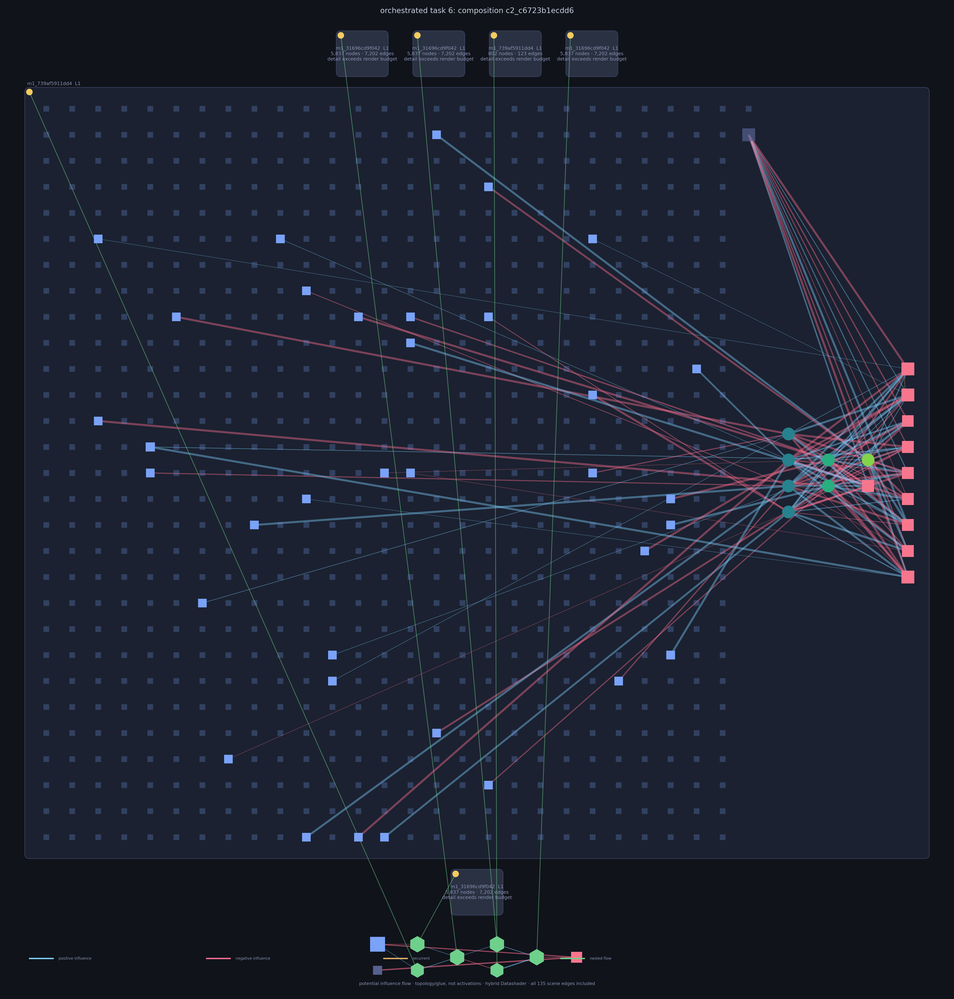

# Versal (Versatile Evolution of Reusable Structure for Adaptive Learning)



**Toward task-general intelligence with persistent, compounding neuroevolution.**

Human intelligence is not a single faculty, and intelligence itself is neither uniquely human nor
confined to one substrate. Trying to specify every useful mechanism by hand tends to produce narrow
or jagged systems. Versal starts from a different premise: search for structure, preserve what works,
and let later searches build on the accumulated result.

The long-term aim is a system that is not taught a vocabulary of solutions, but can develop the
machinery it needs to read, hear, see, reason, and adapt. The present project is an early, measurable
step toward that aim—not a claim of general intelligence or consciousness. It is a research system
for testing whether one evolutionary process can cross task modalities while retaining and reusing
its discoveries.

The broader research program ultimately asks whether this road can support genuine agency,
objectness, selfhood, and conscious experience. Versal currently supplies no operational measure of
those properties; benchmark capability and subjective experience are separate claims.

## What Versal is today

Versal is a Python 3.12 evolutionary neural architecture search system. Evolution owns network and
composition structure; gradient descent trains candidate weights. Every accepted result can enter a
persistent library, where it becomes a frozen module available to later tasks.

For an implementation-level reading guide, start with
[the execution walkthrough](ai/walkthrough.md). It follows the live call path through every
control-flow boundary and ends with a reading order for all 66 Python modules.

The system is evaluated on the 18-rung
[Icarus dataset](https://huggingface.co/datasets/Ardea/Icarus-dataset), which moves from Boolean
functions through temporal, image, scientific, audio, and structured-grid problems. Task handling is
driven by tensor descriptors—value type, axes, and widths—not by benchmark names or rung numbers.
Pool discovery streams only task identity metadata, pins the Hub revision, and selects across
Parquet shards. The selected shard enters Hugging Face's normal disk cache on first use, while only
the currently scheduled task is decoded into memory.

```text
task
  → build a support-only search view
  → test compatible library entries and optionally refine a hit
  → try configured decomposition and recurse under bounded depth/time
  → route frozen experts
  → synthesize from recurring graph grammar
  → evolve a task-shaped network
  → compose reusable modules
  → select an executable parent and update the persistent library
  → measure held-out query data once for reporting
  → atomically checkpoint records, topology, scheduler, and library state
```

The persistent library is both memory and an expanding structural vocabulary. A solution can be
reused directly, embedded as a module, assembled into a deeper composition, or selected by the
learned sparse router. Below-threshold executable champions may also survive as stepping stones so
that repeated attempts do not always restart from nothing.

### Execution control flow

1. `versal.main:main` parses CLI overrides, loads the inherited TOML config, resolves device and
   assessment execution policy, starts optional ClearML plumbing, and constructs the trial.
2. `OrchestratedTrial` creates or resumes the run directory, persistent library, run-local topology
   tabu, scheduler, reports, display, locks, and rolling checkpoint.
3. For each scheduled task, the trial gives `Orchestrator.solve` a support-only search view. In
   blind-query mode, query tensors are unavailable to search, training, admission, and reuse
   decisions.
4. The orchestrator tries compatible library lookup, optional refinement, wall reuse, decomposition,
   and then the registered strategy ladder. Child solves re-enter the same method under depth and
   wall-clock limits.
5. The current canary ladder is `routed → grammar → direct → composition`. `field` is a fifth
   registered and test-backed strategy that can be enabled explicitly for compatible spatial
   mappings, but it is not in the current canary `evolve` list.
6. Strategies use the registry-built evolutionary loop: initialize or restore, select, cross,
   mutate, decode, train, evaluate support metrics, compute novelty/fitness, speciate, and retain the
   next population.
7. The chosen executable parent is admitted or retained according to support evidence and library
   policy. Only after selection may a blind query measurement be taken once for reporting.
8. The trial atomically writes task records, summaries, reports, library/topology state, and
   checkpoint state. Escape, deadlines, declines, failures, and resume preserve this boundary
   discipline.

The complete method is defined by [`configs/canary.toml`](configs/canary.toml); plain `uv run app`
uses the reduced [`configs/smoke.toml`](configs/smoke.toml) overlay.
[`runtime_inventory.json`](runtime_inventory.json) is the exhaustive machine-readable registry,
config, entry-point, and persistent-path surface.

## July 15, 2026 canary

The first full-method canary after the latest engineering changes began with an empty library and
attempted one task from every rung. Its immutable evidence is in
[`ai/archive/20260715_canary`](ai/archive/20260715_canary).

| Result | Observed value |
|---|---:|
| Tasks completed | 18 / 18 |
| Generations | 720 |
| Recorded task time | 6,925.5 s |
| Outcomes | 9 evolved, 2 decomposed, 7 failed |
| Held-out query coverage | 16 / 18 |
| Mean support accuracy | 0.8312 |
| Mean held-out query accuracy | 0.6626 |
| Persistent library growth | 0 → 23 entries |
| Final structures | 7 modules, 16 compositions, maximum level 6 |

This run shows that the same persistent process can execute across all 18 modalities. Spatial
decomposition, routed distillation and recovery, cross-task reuse, router-v2 persistence, and
recursive composition were all exercised in one real run; the canary does not isolate their causal
effects. Cosmic reached 0.9837 held-out accuracy after spatial decomposition. ARC reached 1.0
support but only 0.20 held-out cell accuracy; that is not an exact-grid ARC solve.

The canary is one seed with one curriculum task per rung. It has no matched baseline or ablation,
and support fitting often failed to generalize: the mean support-to-query gap was 0.1686. Psicov
and PGM produced no executable parent before their deadlines, so their query values are missing,
not zero. The archive also lacks contemporaneous exact-grid, shape, coverage, and baseline fields.
Lifecycle retirement, topology-deduplicated refinement, graceful Escape shutdown, motif
counterfactuals, and archive deduplication are test-backed but were not exercised as outcomes in
this short run. Larger, multi-seed cluster experiments remain pending.

## Quick start

```bash
uv sync --group dev
uv run app
```

Plain `uv run app` selects the smoke profile. It keeps the complete strategy ladder but reduces
populations, training, recursion, and data so an M4-class workstation can expose broken end-to-end
wiring quickly. Run the full local method with:

```bash
uv run app --config configs/canary.toml
```

The library and results are durable, gitignored experiment state. Use an explicit path when an
experiment must not share prior discoveries:

```bash
uv run app --config configs/canary.toml --library-dir /tmp/versal-cold-library
uv run app --resume results/<timestamp>_orchestrated
```

During an interactive run, press **Escape** to request a cooperative stop. Versal finishes the
current optimizer or generation boundary, restores the terminal, writes the resumable checkpoint,
refreshes reports, and marks the run `stopped`. Ctrl-C remains an immediate interruption path.

## Run profiles

All live profiles inherit the complete method in [`configs/canary.toml`](configs/canary.toml).

| Profile | Purpose | Intended scale |
|---|---|---|
| `smoke.toml` | Catch integration and wiring failures across all rungs | One reduced task per rung; about 10–30 minutes |
| `canary.toml` | Exercise the complete local method | One deep task per rung; about 1–2 hours |
| `brute.toml` | Repeatedly search one editable rung for capability and simpler solutions | Long, deep task-family campaign |
| `preflight.toml` | Establish workstation confidence before renting compute | Ten tasks per rung; about 14–25 hours on an M4 Max |
| `canary-lattice.toml` | Check CUDA parity while ClearML observes the local process | One task per rung on an RTX 3080 |
| `full_cluster.toml` | Run the flagship multi-seed campaign with adaptive resource limits | Twenty tasks per rung per seed |

The brute profile’s target is the `schedule.rungs` value in its file. Its always-on refinement
budget keeps revisiting solved signatures, with novelty and complexity pressure seeking a better or
simpler topology before the known-good solution is retained as fallback.

On the Lattice workstation, these commands keep execution in the current terminal while attaching
the run to ClearML:

```bash
uv run app --config configs/smoke.toml --machine LocalLatticeCUDA --clearml
uv run app --config configs/canary-lattice.toml
uv run app --config configs/preflight.toml --machine LocalLatticeCUDA
```

Use `LocalLatticeCPU` to force local CPU execution instead. The older `LatticeCUDA` and
`LatticeCPU` labels deliberately retain their original meaning: enqueue to the corresponding
ClearML agent and exit the submitting process.

## What a run records

Each run directory contains pinned source and effective configs, a rolling checkpoint, and a
durable `run_summary.json`. Every summary update atomically refreshes:

- `rung_summary.csv` for one-row-per-rung comparison;
- `run_report.json` for schema-versioned analysis;
- `run_report.md` for provenance, metrics, strategy behavior, timing, and limitations.

Support accuracy is search-time evidence. Held-out query accuracy is the primary reported outcome.
The Rich display keeps those values visually distinct and always explains a missing measurement;
the JSON retains exhaustive stage, resource, strategy, and lifecycle diagnostics.

The library writes individual network images plus two routed portraits:

- `library/images/overmind.png` preserves live and retired history;
- `library/images/overmind_pruned.png` removes retired networks and compacts the remaining cards
  into the same eight-column layout.

## Tools

### Run and compare experiments

```bash
uv run app [--config <profile>]             # evolve through the configured task stream
uv run run_matrix --seeds 0,1,2 --cold      # compare seeds without sharing learned state
uv run ablation_suite --dry-run              # materialize controlled mechanism-removal campaigns
```

### Inspect behavior and evidence

```bash
uv run run_report results/<run>              # rebuild held-out, timing, strategy, and storage summaries
uv run rung_doctor --rungs 1-18              # inspect task availability, descriptors, and tensor shapes
uv run render --overmind                      # inspect library networks and learned routing traffic
uv run motif_census --render                  # count recurring graph structures and independent reuse
uv run motif_census --run results/<run> --discover  # rank non-plumbing motifs against structural nulls
uv run benchmark                              # measure candidate-training throughput on this machine
uv run cppn_spike --offline                   # test sparse coordinate-generated topology seeds in isolation
```

### Maintain persistent state

```bash
uv run library_gc --dry-run                   # preview unreachable retired entries before deletion
uv run router_migrate --library <v1> --output <copy>  # create a verified sharded copy of a legacy router
uv run experiment_archive list                # inspect content-addressed external experiment snapshots
uv run runtime_inventory --check              # detect drift in configs, registries, CLIs, and durable paths
```

External archive restoration is hash-verified and installed atomically. New snapshots address
files by content, so unchanged run, library, and router data are uploaded once; v1 snapshots remain
listable, verifiable, and restorable.

## ClearML

Set `[run] clearml = true` to record telemetry and artifacts; offline runs remain fully functional.
By default, Versal sends Python logging records but leaves stdout/stderr uncaptured so Rich's
transient progress redraws stay local instead of flooding the ClearML console. Set
`[run] clearml_capture_streams = true` only when a non-interactive run needs complete raw stream
capture.
Versal deliberately disables ClearML’s automatic PyTorch model attachment. Router shards loaded by
`torch.load` are internal evolving state, not alternative input models; automatic attachment made
many identically named shard loads look like ambiguous model inputs. Versal uploads deliberate
artifacts explicitly instead.

## Project map

```text
versal/evolution/             genomes, operators, populations, and compositions
versal/dataset/               the vendored Icarus runtime
versal/trials/                the supported orchestrated run
versal/tools/                 reports, diagnostics, campaigns, migration, and maintenance
versal/utils/                 config, display, shutdown, ClearML, devices, and resources
configs/                      the complete method and scale/hardware overlays
tests/                        offline regression and integration coverage
library/                      persistent learned state (gitignored)
results/                      run state and reports (gitignored)
paper/                        manuscript, evidence manifest, and build tooling
ai/walkthrough.md             current-code execution guide
runtime_inventory.json        generated registry/config/path contract
```

Do not edit `versal/dataset/icarus.py` directly; it is vendored/generated. New evolutionary
behavior should be registered and selected through configuration rather than hard-coded into the
loop.

## Development

```bash
uv run ruff check .
uv run ruff format .
uv run ty check
uv run pytest tests/ -v
uv run runtime_inventory --check
```

Tests are offline and fixture-driven. Before making a scientific claim, freeze the run and library
evidence, distinguish missing metrics from valid zeroes, and report held-out behavior separately
from support fitting. See [`ai/walkthrough.md`](ai/walkthrough.md) for the current execution path and
[`paper/preprint.md`](paper/preprint.md) for the research argument and its evidence boundaries.
