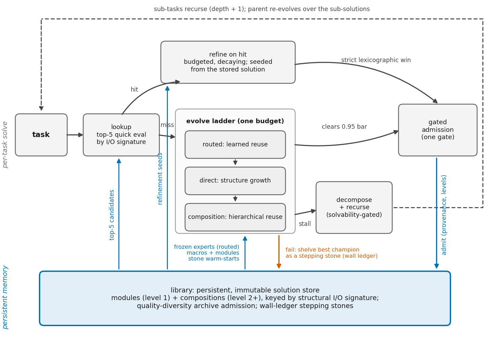
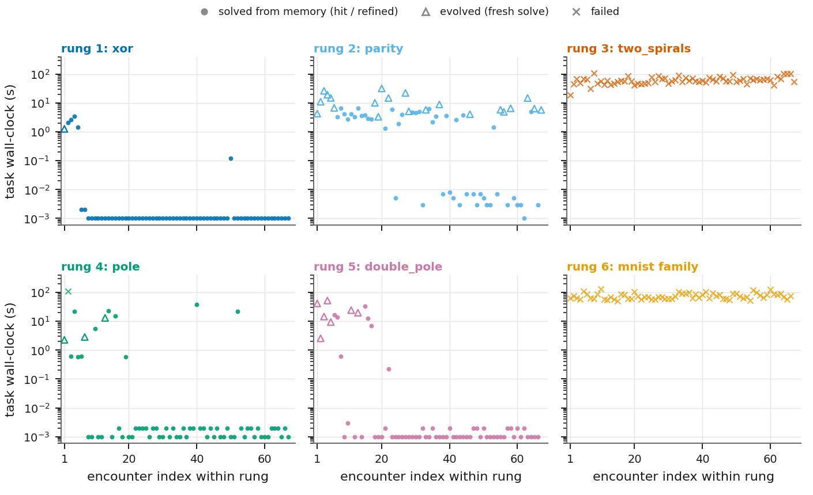
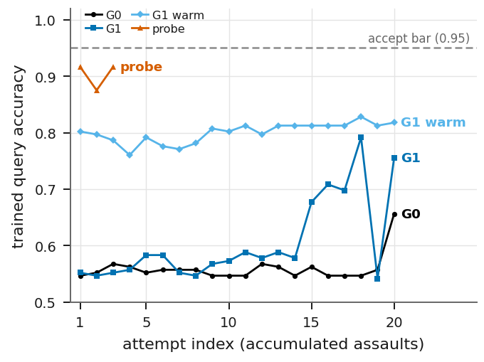
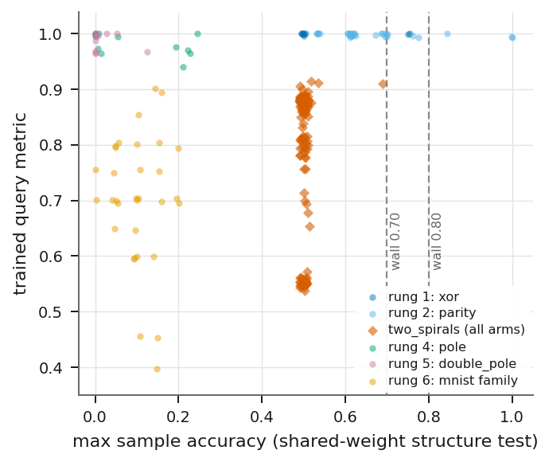
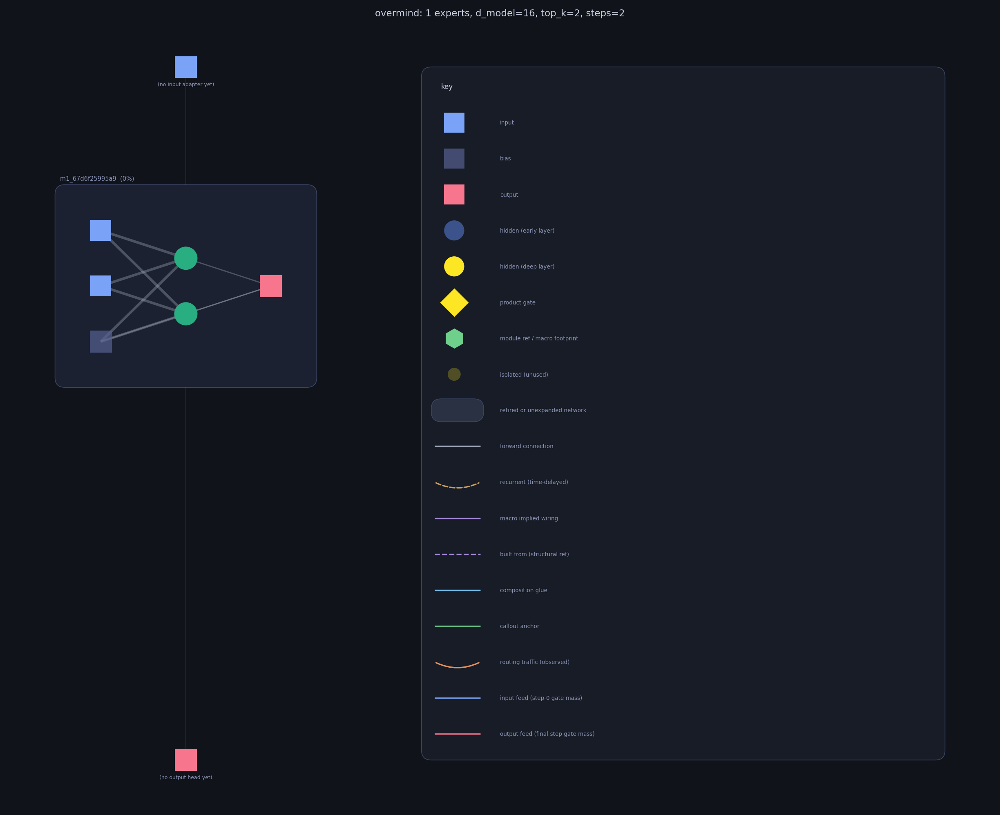
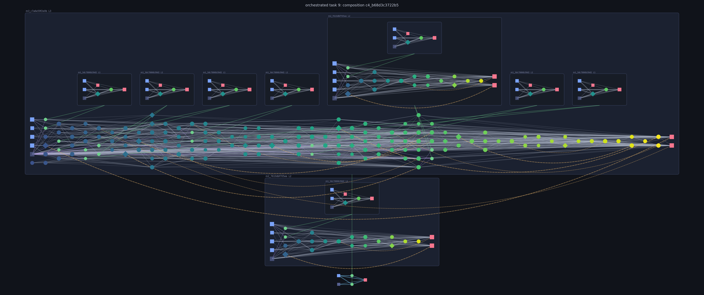
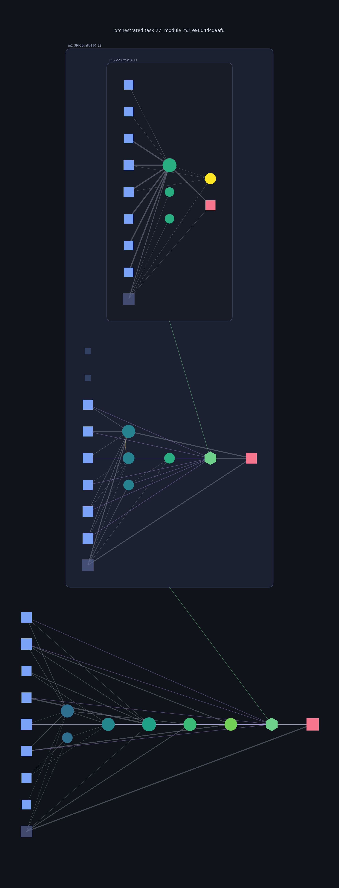
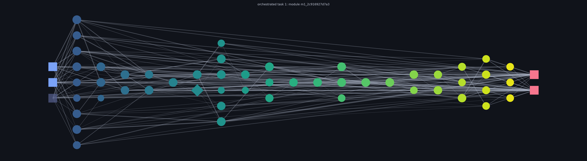
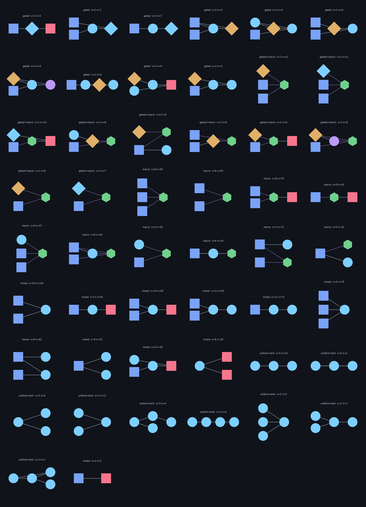

# ArdEVO: Orchestrated Neuroevolution with a Persistent, Compounding Solution Library

**John Gardner**
Ardea AI
john@ardea.io

*Working draft, revised 2026-07-12. The method and reproducibility pipeline are current; `paper_todo.md` enumerates the run-gated evidence still required for submission.*

---

## Abstract

Systems that acquire skills efficiently across unfamiliar tasks need more than a strong learner: they need a memory that survives the next task. We present ArdEVO, a neuroevolution system that grows network topologies from minimal complexity, stores every verified solution in a persistent library keyed only by structural input/output signatures, and treats that library as the substrate for all future search. A per-task orchestrator escalates through a ladder of increasingly expensive mechanisms: library lookup (a solved task stays solved at zero marginal cost), budgeted refinement seeded from the stored solution, a learned sparse mixture-of-experts router whose experts are frozen library entries, direct NEAT-lineage structural evolution with a gradient inner loop that owns the weights, hierarchical composition of library modules, and task decomposition with recursion. Admission back into the library is gated by a quality-diversity archive that niches solutions by behavior, and below-bar champions are shelved as stepping stones that warm-start later assaults on the same task family. We evaluate on Icarus, a purpose-built 18-rung difficulty ladder spanning XOR to ARC-AGI under a single differentiable task contract. In a completed, cold-start 400-task run over rungs 1 to 6, the loop compounds as designed: 234 of 400 task encounters resolve from memory (217 zero-evolution library hits plus 17 stored solutions strictly improved under budgeted refinement), rungs 1, 2, 4, and 5 solve 266 of 267 attempts, the library grows five levels of composition depth unscripted, and 131 assaults on the two unsolved families warm-start from shelved stepping stones. A controlled case study on the two-spirals task then uses a weight-robustness diagnostic to separate what evolved structure encodes from what gradient training adds, exposing a representation wall: multi-objective novelty search moves the trained plateau from 0.656 to 0.792 (0.828 with warm-library compounding) while the structure-only diagnostic stays below the pre-registered wall thresholds in every arm, and a generative-encoding spike shows the missing solutions are expressible at 14x lower complexity yet not discoverable under per-candidate training budgets, a training-time valley that a scheduled trainer measurably crosses. We release the system, the benchmark, and the full diagnostic protocol.

---

## 1 Introduction

A model trained for one task is an artifact; a system that gets cheaper at solving each next task is closer to intelligence as Chollet (2019) defines it: skill-acquisition efficiency over novel tasks. Most architecture search work optimizes the artifact. A search produces one network for one benchmark, the network is measured, and the search process, along with everything it discovered on the way, is discarded. The next task starts from scratch.

ArdEVO starts from the opposite commitment: **the library is the memory**. Every task the system solves ends as an immutable, deduplicated entry in a persistent on-disk library, keyed only by the structural shape of its inputs and outputs, never by task name or benchmark identity. Every future task begins by consulting that library. Solutions compound: mini-models (level 1) become components of compositions (level 2), which become components of deeper compositions (level 3+), and the marginal cost of a familiar task falls toward zero. The design was forced by a measured failure: an earlier single-population variant that carried one shared topology across interleaved tasks scored 1.0 on the active task and chance on every task learned before it, catastrophic forgetting expressed structurally (McCloskey and Cohen, 1989; French, 1999). Freezing verified solutions into an external, growing memory, rather than a single plastic network, is the anti-forgetting mechanism, in the spirit of progressive networks (Rusu et al., 2016) but with the growth driven by evolution and the reuse driven by search over a typed library.

Two further commitments shape everything downstream.

**Structure is evolved, weights are trained.** ArdEVO is NEAT-lineage (Stanley and Miikkulainen, 2002): populations of graph genomes grow from minimal complexity through structural mutation, speciation protects innovation, and historical markings align crossover. But weight search is delegated entirely to a per-candidate gradient inner loop with Lamarckian writeback (Whitley et al., 1994; Hinton and Nowlan, 1987): every rung of the benchmark is expressed as a differentiable supervised task precisely so that one gradient trainer spans the whole ladder. Pure weight evolution failed to solve even XOR in our setting, and random weight perturbation measurably fights the optimizer, so the division of labor is strict: evolution proposes topology, the gradient disposes of weights.

**No human priors smuggled in.** The library must be populated only by what the system itself evolves. We do not seed convolution, attention, or recurrent cell templates, and the mutation operators encode at most generic geometric bias (locality over stamped coordinates), never a specific architecture. The project's standing constraint is that hand-injecting known-good primitives "would be presuming humans are the only form of intelligence"; the interesting question is whether the growth mechanics themselves can be made expressive enough. This choice costs performance today (Section 7) and we measure exactly where.

The system that results is an orchestrated escalation ladder run per task (Section 4): look the task up; if a stored solution clears the accept bar, optionally spend a small decaying budget trying to beat it, seeded from it (a live/learn dial inspired by DreamCoder's wake-sleep cycle; Ellis et al., 2021); on a miss, try a learned sparse mixture-of-experts router over frozen library entries (Jacobs et al., 1991; Shazeer et al., 2017), whose wins must distill into verified compositions before they count; try typed graph programs induced only from motifs independently rediscovered in the library; escalate to direct structural evolution on the task's real I/O and then to evolving compositions over a shared module pool (the idea, though not the algorithm, of CoDeepNEAT; Miikkulainen et al., 2017); on a stall, decompose the task, recurse on the parts, and re-evolve the parent over the newly admitted sub-solutions. Failures above a floor are shelved as below-bar stepping stones that warm-start the next assault on the same task signature, an explicit mechanization of the stepping-stone principle from open-endedness research (Lehman and Stanley, 2011; Ecoffet et al., 2021). Admission niches entries by behavior descriptor in a quality-diversity archive (Mouret and Clune, 2015; Pugh et al., 2016) so that diverse partial solutions coexist instead of collapsing to a top-k monoculture.

We evaluate on **Icarus**, a purpose-built 18-rung ladder (Section 3) that spans XOR, parity, two-spirals, pole balancing, MNIST/CIFAR, the nine NAS-Bench-360 task families (Tu et al., 2022), RAVEN/PGM, and ARC-AGI, all under one descriptor-typed contract in which loss dispatch never inspects the task's identity. The ladder is a curriculum (Bengio et al., 2009) at the level of whole tasks, and the portability constraint (library signatures derive only from field descriptors) is what makes ARC-AGI-3 (ARC Prize Foundation, 2026) reachable by adapter rather than redesign.

### Contributions

1. **A compounding search architecture.** The orchestrated ladder unifies persistent signature-keyed memory, budgeted refinement of stored solutions with a fairness protocol, a routed mixture-of-experts over frozen evolved modules with a distill-to-admit contract, an independently supported and MDL-gated graph grammar, hierarchical composition with fitness attribution, decomposition with a solvability gate, and a wall ledger of stepping stones. Each mechanism is independently switchable.
2. **A benchmark contract for task-general search.** Icarus expresses 18 difficulty rungs as one differentiable interface (typed fields, support/query splits, descriptor-driven loss dispatch), so a single system can climb from XOR to ARC without per-task code. We state the contract precisely and release the diagnostic tooling that keeps a "full ladder" run honest.
3. **A structure-versus-weights diagnostic protocol.** Borrowing the weight-sharing evaluation of WANNs (Gaier and Ha, 2019) as a per-champion statistic, we show how to attribute progress to evolved structure versus gradient training, and we use it to identify a representation wall on two-spirals that neither divergent selection nor compounding crosses, while both measurably move the trained plateau.
4. **Measured mechanism studies.** Controlled single-flip gates quantify: multi-objective novelty selection (NSGA-II over accuracy, novelty, wiring cost) lifting the two-spirals plateau 0.656 to 0.792 cold and 0.828 warm; a training-time valley in which correct generator topologies are selected against because per-candidate budgets cannot reveal their worth, and a scheduled trainer that crosses it (0.55 to 0.92 on the same topology); and an expressibility/discoverability gap for generative encodings (complexity 65 versus 903 for equal function).
5. **An engineering discipline for search systems.** Every performance refactor is pinned bitwise-identical by test, every lever is verified inert when off, and the run loop emits per-task forensic records (stage timings, failure stages, refinement ledgers) that turned two multi-hour production stalls into diagnosed, fixed, and regression-guarded incidents.

We are explicit about status: the reported campaigns exercise rungs 1 to 6 end to end, with rungs 3 and 6 still unsolved under the orchestrated regime. A coverage run completes bounded attempts on every rung 1 to 18 under the wall levers, with one init-wall rung solved (Section 10). The current implementation now provides blind support-only search, exact-grid ARC reporting, output-shape inference, baseline and coverage metrics, bounded adaptive decomposition, and a no-memory control, but no new ARC solve is claimed. The companion document `paper_todo.md` enumerates the ablation and scaling program required before submission.

---

## 2 Related Work

### 2.1 Neuroevolution and topology growth

NEAT established the recipe ArdEVO's leaf search still follows: complexify from minimal topologies, protect innovation with speciation, and align crossover with historical markings (Stanley and Miikkulainen, 2002). Incremental evolution on progressively harder task versions predates it (Gomez and Miikkulainen, 1997), and cooperative synapse coevolution showed the power of decomposing the search itself (Gomez et al., 2008). ArdEVO differs from classical NEAT in three load-bearing ways: the weight space is handled by gradient descent inside the loop rather than by mutation; node genes carry typed extensions (product aggregation, recurrent edges, per-genome refinement depth, frozen macro references); and the unit of progress is a persistent cross-task library rather than a single run's champion. Cascade-Correlation is an early non-evolutionary relative that also grows hidden units one at a time and trains them by gradient (Fahlman and Lebiere, 1990); its benchmark, two-spirals (Lang and Witbrock, 1988), is our rung-3 case study. Modern NEAT descendants evolve recurrent memory cells at scale (Ororbia et al., 2019), and hybrids that train NEAT-grown topologies by backpropagation, batched for the GPU, are an active line (Merry et al., 2024); ArdEVO differs in what survives the run, a cross-task library rather than a single champion. The broader agenda of neuroevolution as a path to open-ended intelligence is surveyed by Stanley et al. (2019).

Indirect encodings matter to us twice. CPPNs (Stanley, 2007) and HyperNEAT (Stanley et al., 2009; Risi and Stanley, 2012) generate large phenotypes from small genomes by exploiting geometry; ArdEVO's generative initialization and its two-spirals generator spike (Section 7.3) are CPPN-lineage, but the phenotype is queried over an abstract index continuum rather than a hand-designed substrate geometry, preserving the no-priors constraint. Weight Agnostic Neural Networks (Gaier and Ha, 2019) contribute a different idea: evaluating a topology under shared weight samples measures how much of the solution the structure itself carries. ArdEVO adopts this as its **library admission currency** (robust modules compose better) and, in Section 7, as the diagnostic statistic that separates representation failures from search failures. CoDeepNEAT (Miikkulainen et al., 2017) contributes the two-level blueprint/module scheme that inspired our composition strategy; we deliberately implement the idea (compositions reference module species; fitness attributes downward) rather than the algorithm, and our modules are whole trained networks with typed ports rather than layer specifications.

### 2.2 Neural architecture search

Modern NAS frames architecture design as search over a fixed operation vocabulary: reinforcement-learned controllers (Zoph and Le, 2017), large-scale evolution (Real et al., 2017), aging evolution (Real et al., 2019), parameter-sharing surrogates (Pham et al., 2018), and differentiable relaxation (Liu et al., 2019); Elsken et al. (2019b) survey the field. ArdEVO shares the evolutionary machinery but rejects the fixed vocabulary: there are no conv/attention/pooling cells to select among, because the vocabulary itself is what we require the system to discover. NAS-Bench-101 (Ying et al., 2019) standardized evaluation within one search space; NAS-Bench-360 (Tu et al., 2022) widened evaluation to diverse task modalities and is directly incorporated as Icarus rungs 8 to 16. Where NAS benchmarks measure a search algorithm's endpoint, Icarus measures a system's trajectory across tasks: what carries over, what compounds, and what a familiar task costs the second time.

### 2.3 Quality-diversity and open-endedness

Objective-only search is deceptive: rewarding progress toward the goal discards the stepping stones the goal requires (Lehman and Stanley, 2011; Woolley and Stanley, 2011). Quality-diversity algorithms keep an archive of diverse elites instead (MAP-Elites: Mouret and Clune, 2015; framing: Pugh et al., 2016), and open-endedness research builds systems that generate their own increasingly complex challenges (Stanley et al., 2017; Brant and Stanley, 2017; Wang et al., 2019, 2020; Faldor et al., 2024). Go-Explore operationalizes "first return, then explore," archiving states as stepping stones (Ecoffet et al., 2021). ArdEVO imports three specific mechanisms: library admission is a QD archive niched by (I/O shape, behavior descriptor) with per-niche caps; selection can blend k-NN behavioral novelty and wiring cost into a Pareto front (NSGA-II) alongside accuracy; and the wall ledger explicitly shelves below-bar champions as seeds for future attempts, which Section 7 shows lifting repeated assaults on a hard task family. Clune (2019) argues for AI-generating algorithms that learn as much as possible rather than hand-design; ArdEVO's no-priors constraint is that argument taken as an engineering rule.

### 2.4 Library learning and self-improving synthesis

DreamCoder alternates wake-phase problem solving with sleep-phase library compression, growing a DSL of reusable program components (Ellis et al., 2021); Stitch made the compression tractable at scale (Bowers et al., 2023), and successors fold LLM guidance into the same wake-compress cycle, refactoring solution corpora into documented, reusable libraries (Grand et al., 2024; Stengel-Eskin et al., 2024). ArdEVO's library plays the same role for evolved networks: admission is compression of a run's discoveries into reusable, typed, immutable entries, refinement-on-hit is a bounded wake-phase improvement dial, and the motif census (Section 6.4) is an explicit search for recurring substructure across entries, the network analogue of DSL abstraction discovery. The distinction is the medium: our library entries are trained subnetworks with structural signatures, not symbolic programs, so reuse is by composition and routing rather than by term rewriting. Recent LLM-driven systems evolve program populations against evaluators (FunSearch: Romera-Paredes et al., 2024; AlphaEvolve: Novikov et al., 2025), self-improve on ARC through synthesis-and-finetune loops (Pourcel et al., 2025), rewrite their own scaffolding (Darwin Godel Machine: Zhang et al., 2025), or archive discovered agent designs as building blocks for further meta-search (Hu et al., 2025). Closest of all in spirit is Voyager (Wang et al., 2023), an embodied agent whose ever-growing library of compositional, interpretable skills is explicitly its anti-forgetting mechanism; ArdEVO pursues the same memory architecture with sub-symbolic, evolved modules. Against all of these, ArdEVO shares the compounding ambition but keeps the substrate neural and the improvement loop gradient-plus-evolution, with no language model anywhere in the system; the recent skill-library literature is, to our knowledge, uniformly LLM-and-code-based, and we are not aware of a published system that maintains a persistent cross-task library of evolved neural modules.

### 2.5 Modular networks, routing, and continual learning

The mixture-of-experts idea, a gate dispatching inputs to specialist networks, is as old as Jacobs et al. (1991) and scaled to sparse top-k gating by Shazeer et al. (2017) and Fedus et al. (2022). ArdEVO's routed strategy is a sparse MoE with two inversions: the experts are not trained jointly with the gate but are frozen, independently evolved library entries appended over time (growth is an append, never a resize), and a routed win is not accepted as weights, it must distill into an explicit composition that passes verification before admission. This connects to routing networks for multi-task learning (Rosenbaum et al., 2018), modular meta-learning (Alet et al., 2018), neural module networks composed by structure (Andreas et al., 2016), and soft layer ordering, which learns task-specific assemblies of shared modules (Meyerson and Miikkulainen, 2018). PathNet evolved pathways through a fixed supernetwork (Fernando et al., 2017); ArdEVO evolves the modules themselves and learns the pathways. On the continual-learning side, parameter-protection methods such as EWC (Kirkpatrick et al., 2017) and architectural methods such as progressive networks (Rusu et al., 2016) and dynamically expandable networks, which grow capacity per task (Yoon et al., 2018), address forgetting inside one network (Parisi et al., 2019). Continual NAS makes the reuse-versus-grow decision explicit per task (Li et al., 2019), and modular continual learners maintain a growing pool of frozen modules with per-task search over which to reuse (Veniat et al., 2021), a fast assemble / slow admit split that lifelong compositional frameworks state in general form (Mendez and Eaton, 2021). ArdEVO makes the same decisions through library lookup, absorption, and gated admission, with evolution rather than gradient relaxation proposing the structure, and sidesteps intra-network forgetting by making the durable unit an immutable library entry, accepting library growth as the cost (bounded by per-signature caps and tombstoned garbage collection).

### 2.6 Learning-guided evolution and adaptive computation

Hinton and Nowlan (1987) showed learning can guide evolution across a needle-in-a-haystack landscape; Lamarckian writeback versus Baldwinian inheritance is a classical trade (Whitley et al., 1994), and Lamarckian weight inheritance also underlies modern multi-objective NAS, where network morphisms carry trained weights across architecture mutations (Elsken et al., 2019a). ArdEVO is deliberately Lamarckian (trained weights write back into the genome) because the library stores solutions, not just genotypes, and Section 7.3 documents a modern instance of the Hinton-Nowlan effect in reverse: with too little per-candidate training, even a hand-planted correct topology is selected against, so trainability, not reachability, gates discovery. Self-adaptive strategy parameters are standard in evolution strategies (Beyer and Schwefel, 2002; Hansen and Ostermeier, 2001); ArdEVO applies log-normal perturb-and-inherit to per-genome mutation-operator rates. On the phenotype side, ArdEVO's refinement substrate (a genome re-applies its tiny network to a static input for a learned number of passes, with deep supervision at every pass) is the evolutionary port of recursive tiny-network reasoning (Jolicoeur-Martineau, 2025; Wang et al., 2025), and its routed unroll with learned geometric halting follows adaptive computation time (Graves, 2016; Banino et al., 2021; Dehghani et al., 2019). Iterating a network to a fixed point as implicit depth echoes deep equilibrium models (Bai et al., 2019).

### 2.7 Benchmarks and software

Icarus rungs incorporate MNIST (LeCun et al., 1998), Fashion-MNIST (Xiao et al., 2017), CIFAR (Krizhevsky, 2009), pole balancing in its classic neuroevolution role (Gomez and Miikkulainen, 1997), NAS-Bench-360 families (Tu et al., 2022), RAVEN (Zhang et al., 2019) and PGM-style abstract reasoning (Barrett et al., 2018), and ARC-AGI (Chollet, 2019; Chollet et al., 2025; ARC Prize Foundation, 2026). On tooling: we evaluated and declined the accelerated-neuroevolution frameworks EvoJAX (Tang et al., 2022), evosax (Lange, 2023), and EvoX (Huang et al., 2024) because they optimize fixed-shape parameter vectors while our search mutates graph structure per candidate; TensorNEAT (Wang et al., 2024) pads variable topologies into fixed tensors for JAX, and we ported that one idea natively to PyTorch as our batched population trainer rather than adopting the JAX stack (Section 8 reports when it pays and when it does not).

---

## 3 The Icarus Ladder

Icarus is the data contract the whole system is built against: a single typed interface under which every task, from XOR to ARC, is a differentiable supervised problem. The dataset is generated by a separate open repository and published on the Hugging Face Hub (`Ardea/Icarus-dataset`); ArdEVO vendors only the loader/encoder runtime.

### 3.1 The task contract

A **Field** is a tensor plus the descriptor an encoder needs: `axes` (one semantic axis per dimension, from {EXAMPLE, CHANNEL, TIME, HEIGHT, WIDTH, DEPTH, EXTRA}), a `value_type` in {BINARY, CATEGORICAL, MULTILABEL, CONTINUOUS, ORDINAL}, `n_classes` where class-bearing, an optional `value_range` for continuous normalization, and an optional boolean mask marking padding. A **Task** is a non-empty `support` list and a `query` list of `(input_Field, output_Field)` pairs: the inner loop fits on support and is scored on the held-out query. Tasks with authoritative native splits (XOR, ARC) are marked `fixed_split` and are never re-split; bucketed rungs re-split reproducibly under a crc32-stable seed so the same task yields the same split across runs and processes.

Three invariants do the load-bearing work:

- **Loss dispatch never sees the task's identity.** Cross-entropy for CATEGORICAL/ORDINAL, BCE-with-logits for BINARY/MULTILABEL, MSE for CONTINUOUS, uniformly mask-weighted. One gradient inner loop therefore spans all 18 rungs.
- **Structural signatures only.** A task's library identity is `value_type|axes` plus flattened widths, derived purely from field descriptors, deliberately ignoring rung, name, and kind. Any future task source with the same structural shape (the ARC-AGI-3 adapter case) hits the same library entries. This is the portability constraint that shapes the entire memory design.
- **Interactive provenance is not a regime.** Rungs 4 and 5 derive from policy rollouts but are stored and scored as ordinary differentiable pairs; no environment simulator exists anywhere in the consumer.

The reference **Level0Encoder** flattens inputs to `[batch, width]`, min-max normalizes CONTINUOUS fields into [0, 1], zeroes padded positions, and fits to a target width; a **TemporalEncoder** rebuilds the TIME axis that Level0 flattens (inputs become `[batch, time, features_per_step]`) and is pinned bitwise-equivalent to Level0 at T=1 so temporal and flat scores are directly comparable.

### 3.2 The rungs

| Rung | Family | Tasks | Contract (input -> output, flattened widths) | Note |
|---|---|---|---|---|
| 1 | `xor` | 1 | BINARY 2 -> BINARY 1 | fixed split 4/4; minimal 2->1 topology caps at 75%, so a solve must grow structure |
| 2 | `parity.n4..n8` | 9 | BINARY <=8 -> BINARY 1 | n4 has 16 examples total; query is anti-generalization at n4 |
| 3 | `two_spirals` | 1 | CONTINUOUS 2 -> CATEGORICAL 2 | fixed split 194/192; the generalization case study of Section 7 |
| 4 | `pole.*` | 39 | CONTINUOUS 4 per step -> 1 (temporal) | policy-rollout provenance, differentiable regression |
| 5 | `double_pole.*` | 39 | CONTINUOUS 6 per step -> 2 (temporal) | as rung 4 |
| 6 | MNIST / Fashion-MNIST | 1,200 | CONTINUOUS 784 -> CATEGORICAL 10 | first real image statistics |
| 7 | CIFAR | 1,000 | CONTINUOUS 3,072 -> CATEGORICAL 10 | the wide-image stress point |
| 8 | `ecg` | 1,287 | CONTINUOUS 1,000 -> CATEGORICAL 4 (temporal) | NAS-Bench-360 |
| 9 | `satellite` | 15,625 | CONTINUOUS 46 -> CATEGORICAL 24 (temporal) | NAS-Bench-360 |
| 10 | `ninapro` | 62 | CONTINUOUS 832 -> CATEGORICAL 18 (temporal) | NAS-Bench-360 |
| 11 | `spherical` | 938 | CONTINUOUS 10,800 -> CATEGORICAL 100 | NAS-Bench-360 |
| 12 | `cosmic` | 512 | CONTINUOUS 65,536 -> BINARY 65,536 | NAS-Bench-360; dense output |
| 13 | `darcy_flow` | 32 | CONTINUOUS 177,241 -> CONTINUOUS 177,241 | NAS-Bench-360; dense output |
| 14 | `psicov` | 58 | CONTINUOUS 271k to >=13.97M -> CONTINUOUS 4.8k to >=245k | NAS-Bench-360; widths vary per task; upper entries are observed, not maxima |
| 15 | `fsd50k` | 12,529 | CONTINUOUS 5,632 -> MULTILABEL 200 | NAS-Bench-360 |
| 16 | `deepsea` | 3,489 | CONTINUOUS 4,000 -> MULTILABEL 36 (temporal) | NAS-Bench-360 |
| 17 | RAVEN / PGM | 23,294 | CONTINUOUS 409,600 -> CATEGORICAL 8 | abstract relational reasoning |
| 18 | ARC-AGI | 800 | CATEGORICAL 900 -> CATEGORICAL 9,000 | native demo/test split; the target regime |

Task counts and I/O widths were enumerated live from the published dataset on 2026-07-06 (the probe transcript is archived with the frozen artifacts). Widths are the flattened Level0 view that library signatures key on; temporal rungs additionally unroll the TIME axis under the stepped substrate. Rung difficulty is intrinsic to the data, not to any code path: higher rungs mostly mean wider flattened I/O and harder generalization, not new mechanisms. Those archived probes measure rung 11 (`spherical`) at 10,800 inputs by 100 outputs, rung 12 (`cosmic`) at 65,536 by 65,536, rung 13 (`darcy_flow`) at 177,241 by 177,241, and rung 14 (`psicov`) from 271,377 to 5,095,857 inputs and 4,761 to 89,401 outputs. The 2026-07-12 preflight subsequently observed a larger Psicov task at 13,966,425 by 245,025, so the table reports observed lower bounds rather than a closed maximum. These rungs exceed the minimal-initialization regime (Section 10).

### 3.3 Pool construction and honesty tooling

A run's task pool loads rung by rung, each in its own dataset handle, so one unloadable rung cannot kill or silently narrow a run: every failure or empty rung is recorded as a first-class `SkippedRung` row in the run summary, and the shipping configuration sets `require_all_rungs = true`, which aborts loudly instead. A standalone probe (`uv run rung_doctor`) reports per-rung loadability, task counts, I/O signatures, temporality, and how many library entries match each rung's shape exactly or within tolerance. This tooling exists because an early "full ladder" run silently never scheduled rung 5, and nothing said so; we treat schedule coverage as a reportable result, not an assumption.

The scheduler is itself a pluggable, checkpointable operator; the shipping configuration interleaves rungs round-robin (one task per rung per cycle) so easy and hard families alternate and library effects across rungs are exercised within a single run.

### 3.4 Dataset provenance, hosting, and known issues

The dataset is produced by a standalone generator repository (github.com/ArdeaAI/Icarus-Dataset) and published on the Hugging Face Hub as `Ardea/Icarus-dataset`, one parquet configuration per task family, with per-task support/query membership stored explicitly for `fixed_split` families. ArdEVO vendors only the loader/encoder runtime (a single file under an MIT-with-attribution header, regenerated from the generator repository and never edited in place). All 18 rungs were verified loadable end to end on 2026-07-06; the per-rung probe transcript ships with the frozen artifacts.

Three known issues are documented rather than hidden. First, the vendored loader's default hub id misspells the dataset name with an underscore; every consumer in this codebase passes the correct hyphenated id through configuration, and the default is queued for an upstream fix. Second, the reference encoder min-max normalizes CONTINUOUS fields into [0, 1], which halves the signed domain on zero-centered tasks and doubles the frequency demand on periodic structure (a fact surfaced by the generative-encoding study of Section 7.3); a signed [-1, 1] encoding option is a documented candidate revision to the contract, deferred because changing it invalidates stored library signatures mid-study. Third, variable-size targets cannot share an ordinary fixed-width head without an explicit alignment rule. Generic non-grid tasks still fit the query target to the support width under a mask. The ARC path instead places support and query grids in one support-derived two-dimensional canvas, preserving row boundaries, and reports coverage; unrepresented cells count as incorrect and can never satisfy cell-exact or task-exact metrics. A shape program fitted only on support dimensions predicts the output height and width independently of the fixed tensor head.

---

## 4 The Orchestrated Ladder

Every task is handed to one `Orchestrator.solve(task, depth)` call, which escalates through fixed steps (Figure 1): **lookup** the library; on a hit, optionally **refine**; on a miss, **evolve** through a configurable ladder of strategies under a depth-scaled generation budget with stall detection; on a stall, **decompose** the task, recurse on the parts, and re-evolve the parent over the sub-solutions; **admit** any winner back into the library; and on failure, shelve the best champion as a stepping stone. Every decision, timing, and failure mode lands in a per-task attempts ledger. The governing design rule: **a solve should end in the library as a reusable entry**; a result that lives only in transient weights is not treated as knowledge. The one sanctioned exception is the admission policy itself, which may decline to shelve a winner whose niche is already full of stronger entries (the task still counts as solved, and the rejection is counted).

### 4.1 Lookup: the anti-forgetting step

A task's library identity is its structural I/O signature, `value_type|axes` plus flattened widths, derived only from field descriptors (Section 3.1). Lookup queries the top `quick_eval_top_k = 5` entries matching the signature and runs each through a **quick evaluation**: decode and forward passes only, no training. In the current protocol query targets are absent from lookup, evolution, refinement, admission, and robustness ranking. Dense support accuracy drives progress; admission requires support task-exactness for structured grids and support accuracy elsewhere at threshold 0.95. Only after one immutable payload has been selected is it evaluated once on the held-out query, where structured grids require whole-grid exactness. Search and report metrics occupy separate records, so held-out robustness cannot change what is persisted or retired. A hit costs zero generations. On a miss, before any evolution, the shared module pool absorbs up to two not-yet-seen library entries over its worst non-champion members, preferring unseen behavior niches.

### 4.2 Refinement on hit: the live/learn dial

A pure lookup regime never improves a stored solution; the first topology to clear the bar becomes permanent. The refinement mechanism (`[orchestrator.refine] budget_k`, 24 generations in the shipping configuration, 0 disables it byte-identically) makes hits contestable at bounded cost, in the spirit of DreamCoder's sleep-phase consolidation (Ellis et al., 2021). On a hit, the orchestrator spends up to a per-entry, decaying budget of evolution **seeded from the stored solution**, run through the one strategy matching the entry's shape (modules refine through the direct strategy's seed rail; compositions through the composition rail). Four safeguards make this sound:

- **Fairness by construction.** The incumbent's baseline is `max(stored metric, seed_metric)`, where `seed_metric` is the best trained standing that the seed's own topology achieved inside the refine run, tracked by a weight-agnostic structural fingerprint. A challenger must beat the incumbent given the same training, not beat an untrained snapshot.
- **Clone rejection.** Entry keys hash weights, so a retrained copy always gets a fresh key; the fingerprint check rejects any candidate whose topology equals the incumbent's, closing the retrained-clone loophole entirely.
- **Lexicographic wins only.** A replacement must win strictly on (accept metric, then weight robustness, then lower structural complexity), each inside an epsilon band, and must itself sit at or above the global accept bar. Ties are non-events.
- **Bounded, self-extinguishing cost.** Each consecutive no-gain halves the entry's effective budget (24 to 12 to 6, then skip); the cooldown rides the lineage through replacement, a capability gain (metric or robustness) recharges it, and a compression-only gain spends it. One capability epoch funds a few polish passes, then the family sleeps.

A successful refinement admits through the ordinary rails with `refined_from` lineage provenance and may retire the superseded entry, but only under weak dominance plus a strict margin (or strict simplification at parity). The margin is not pedantry: temporal modules store a degenerate robustness of 0.0, and without it any same-metric retrained clone would tombstone its parent. An earlier build without this rule turned a pole-balancing family into twelve near-identical entries and ten tombstones in one run. A failed refinement returns the original hit, so a task never regresses.

### 4.3 The wall ledger: stepping stones for hard families

A depth-0 failure whose best champion still clears a modest floor (`min_metric = 0.45`) is shelved as a **stepping stone**: a below-bar library entry marked `stepping_stone` in provenance, admitted through the dependency rail (bypassing the quality floors that govern real winners) and constitutionally incapable of becoming a false lookup hit, because lookup re-verifies at the full accept bar. The next attempt on the same task signature warm-starts from the shelved stone: module stones graft into the direct strategy's initial population, composition stones seed the composition loop. One stone per signature lineage; a replacement must differ by structural fingerprint and win the same lexicographic comparison as a refinement. Stones also re-enter the search from four other directions: module-pool absorption, the composition reference catalog, the routed substrate's vertex set, and quick-evaluation candidacy. Repeated assaults on a hard family therefore accumulate trained structure instead of restarting from scratch; Section 7.3 measures this compounding directly. This is a deliberate mechanization of the stepping-stone observation from novelty-search research (Lehman and Stanley, 2011): the system preserves useful failures because the objective alone would discard them.

### 4.4 The evolve ladder: four strategies, one budget

Strategies are registered operators named in config order (`evolve = ["routed", "grammar", "direct", "composition"]`), sharing one depth-scaled generation budget (240 at depth 0, 120 at depth 1, 80 at depth 2). The first strategy to clear the accept bar wins and later ones never run; unused generations carry into the next allocation; if nobody clears the bar, the best loser is reported for possible shelving. Dense progress, rather than the sparse exactness gate, drives stall detection and loser ranking.

**Routed (learned reuse).** The routed strategy treats the library itself as a computational substrate: a sparse mixture-of-experts (Jacobs et al., 1991; Shazeer et al., 2017) whose experts are **frozen library entries** placed as vertices on a shared `d_model = 64` bus. Per-vertex input/output adapters are rank-bottlenecked (`adapter_rank = 4`) so routing cannot be bypassed by learning the task in the adapters; the gate scores vertices by embedding dot products (never a linear layer onto the vertex count, so growth is an append, never a resize) and selects `top_k = 2` per step of a bounded `max_steps = 4` unroll. Module-to-module pathways including cycles are legal because termination is structural, following the bounded-unroll precedent of adaptive computation time (Graves, 2016); an ACT-style geometric halting head and a factorized expert-to-expert edge prior are both on in the shipping configuration. Per task the router first tries **zero-shot** (its analogue of a library hit, at zero generations); otherwise it trains only adapters, gate, and heads by Adam with a load-balancing auxiliary loss and an in-memory replay buffer over recent tasks, billing a flat `generation_cost = 10` rather than real generations. Gate state, embeddings, adapters, and per-vertex traffic statistics persist beside the library and survive across runs.

The load-bearing rule is the **distill-to-admit contract**: a routed win only counts if its dominant pathway (experts whose mean gate weight clears a usage floor, capped at six nodes) can be built into an explicit composition over the fired entries and that composition independently verifies at the accept bar with training. The verified composition is what gets admitted, and it becomes a new routable vertex at the next sync, born at the task's position in the gate's latent space. An adapter-only win that cannot distill reports as a miss and the ladder escalates; a cold library short-circuits at zero cost. This keeps the governing invariant intact: routing may discover reuse, but only explicit, reusable structure enters the memory.

**Grammar (discovered vocabulary).** The grammar strategy promotes a motif only when it recurs in at least two independent refinement lineages and yields positive minimum-description-length gain. A production retains typed terminal and cut ports. Programs are typed DAGs evolved by insertion, deletion, compatible replacement, reconnection, repetition, parallelization, and aligned crossover, then compiled into ordinary genomes or compositions and evaluated through the existing rails. The grammar is deterministic, versioned, rebuildable from the library, and cached until the live key set changes. An empty or interface-incompatible grammar costs zero generations. No operation template is hand-authored: the vocabulary contains only structures the evolutionary process rediscovered independently.

**Direct (structure growth).** The direct strategy runs the flat NEAT-lineage recipe of Section 5 on the task's real I/O widths, with population 64, elitism 2, a hardware-sized process pool, and an independently configured trainer. It is the structure-growing fallback for tasks the library cannot yet express, the home of the geometry operators, the seed rail for refinement, grammar programs, and wall stones, and the source of task-shaped module entries. Its preflight guards count categorical logits rather than raw cells, so a nominal 900-cell ten-class ARC head is correctly treated as 9,000 outputs. Tasks with a TIME axis transparently swap in the temporal adapter and stepped recurrent substrate. The champion is re-scored from its serialized payload before acceptance.

**Composition (hierarchical reuse).** The composition strategy evolves a per-task population of **composition genomes**: small typed DAGs whose nodes reference either live module species from a shared pool or frozen library entries, wired by trainable linear glue (rank-factorized above a size threshold). Before constructing a population, routed distillation, or a dense decomposition skeleton, it computes the exact dense or factorized glue representation and declines candidates above the configured value cap (five million in the shipping configuration; zero disables the guard). This dimension-derived bound is independent of task identity. The strategy wraps the hierarchical loop of Section 4.6 and re-verifies its champion against current module state before acceptance: the best-of-run may carry inner weights predating later module writebacks, so it is re-assessed fresh, with one bounded re-fit allowed, and stale weights or stale metrics can never be persisted.

### 4.5 Decompose and recurse

When the whole ladder fails at depth below `max_depth = 2`, the orchestrator tries registered decomposition operators in config order: `output_slices` (split the output head), `input_subsets` (split the input banks), `time_windows` (split the TIME axis), and `spatial_patches` (tile a spatial band, the grid-to-grid split chosen for ARC portability). An operator must produce at least two subtasks and pass a **solvability gate**: each subtask gets a six-generation probe evolution and must reach support accuracy of 0.6, so the budget is never burned recursing into unsolvable slices (an earlier build lost 64 consecutive decompositions to exactly that). Sub-solutions admit as dependency entries; the parent then re-evolves with half its original budget, seeded with a **port-wired skeleton** composition that wires each sub-solution according to its port specification. Success records outcome `decomposed`; failures record which subtask or the parent re-evolve stalled, so recursion failures are attributable.

### 4.6 Admission and the shared module pool

All library writes flow through one gate. Dependency entries (module snapshots referenced by an admitted composition, decompose sub-solutions, wall stones) bypass policy, because a parent entry must never dangle. Top-level winners face the configured admission policy (Section 6.2). Winning compositions are detached from run-local state at admission: every live module reference is snapshotted as a frozen module entry carrying the exact trained weights that scored, and the composition is rewritten to reference the snapshots. Entries record provenance: task, rung, depth, strategy, accepted metric, weight robustness, a behavior descriptor used for archive niching, and lineage fields (`refined_from`, `stepping_stone`). Levels are structural: a leaf module is level 1, and any entry that references others, a composition or a macro-bearing module, sits one above its deepest reference.

The composition strategy breeds against a **shared module pool** (population 64) that persists across tasks within a run: compositions reference module species, module fitness is attributed downward from the compositions that use them (a module is as good as the best composition using it, with decay), only the champion composition writes weights back into its modules, and the pool advances one module generation every third composition generation. The pool is where cross-task recombination happens between admissions.

### 4.7 Budgets, stalls, and the attempts ledger

Four controls bound task cost: the generation budget ladder, the stall detector, an optional per-attempt wall-clock budget (`max_task_seconds`), and dimension-derived pre-allocation caps on flat initialization and composition glue. The wall clock is soft: the running generation finishes, later stages are skipped, and the attempt fails with its best champion still eligible for shelving. The allocation caps act earlier, before a generation boundary exists. Every attempt serializes an `Attempt` row: outcome (`library_hit`, `refined`, `evolved`, `decomposed`, `failed`), metric, generations, winning or best-losing strategy, failure stage, refinement generations, wall seconds, per-stage seconds, champion size metrics, and the structure-versus-weights sample metrics of Section 7.3 when the evaluator emits them.

*Figure 1: The per-task solve ladder (upper tier) and persistent memory beneath it (lower tier). A task escalates through lookup, bounded refinement, routed and grammar reuse, direct growth, composition, and solvability-gated decomposition; every winner passes one admission gate. The library returns lookup candidates, refinement seeds, frozen experts, promoted grammar productions, modules, and stepping-stone warm starts.* Counters register only for mechanisms that are switched on. This ledger is not bookkeeping polish; Section 8 recounts production stalls that were diagnosable only because stage timing and size metrics appear in every row.

---

## 5 The Structural Search Layer

Underneath the orchestrator sits a deliberately conventional generational loop made of unconventional parts. The design rule, enforced across the codebase, is **lego-block evolution**: every stage of the loop (initialization, selection, crossover, mutation, training, evaluation, fitness, speciation, plus the orchestrator-level strategy, decompose, admission, and schedule stages) is an independently registered operator selected and parameterized from the run configuration. Adding a behavior means registering one function; the loop never hardcodes a strategy choice. This is what makes the single-flip gate experiments of Section 7 possible: every lever is a config key, and every lever is verified byte-identical to off when disabled.

### 5.1 Genome and substrate

A genome is a NEAT-style graph description whose connection genes carry real weights, so structure and weights co-evolve and trained weights persist through cloning and admission. Beyond the NEAT baseline, four typed extensions matter:

- **Product aggregation.** A node aggregates its inputs by sum or product; product nodes make gating and second-order interactions evolvable as single units rather than as trained approximations.
- **Recurrent edges.** A connection may be time-delayed (reading the previous step), exempt from acyclicity, inert under the plain feedforward decode, and active under the stepped substrate used for TIME-axis tasks (trained by ordinary backpropagation through time).
- **Refinement depth.** Each genome carries `refine_steps`: how many times the decoded network re-applies itself to a static input, threading latent state through hidden-to-hidden recurrent edges and feeding the current answer back through output-to-hidden edges. This is the evolutionary port of tiny-network recursive reasoning (Jolicoeur-Martineau, 2025): depth of computation becomes an evolvable, per-genome quantity severed from parameter count. `refine_steps = 1` is byte-identical to feedforward, so the lever is free until selected for.
- **Macro genes.** A macro embeds an entire library entry as one frozen unit with one innovation marker: an atomic crossover and speciation unit, resolved at decode time against the live library, with hidden identity stubs for its outputs that every mutation operator is forbidden to retarget. Macros are how the search reuses a discovered network wholesale, the analogue of dropping in a hand-designed cell, except nothing about the cell was hand-designed.

Genomes decode through one router: `refine_steps > 1` yields the refinement substrate, TIME-axis adapters yield the stepped recurrent substrate, and everything else yields the plain feedforward substrate. All three compile the genome into level-ordered dense matrix multiplies with a **compact-column layout**: weight and mask matrices allocate columns only for computed nodes, so a 784-input MNIST genome with a dozen hidden nodes pays for roughly twenty columns (its hidden and output nodes), not 800. The layout is pinned bitwise-identical to the dense reference implementation and is the difference between 400 ms and 30 ms per candidate training call at width 784 (Section 8). Complexity is structural: enabled edges plus hidden nodes plus macro placements.

### 5.2 The mutation menu

Thirteen operators are selected in the default configuration (twenty-three are registered, the newest a gradient-hinted growth trio and pruning operators built for the wide-rung program and unexercised in the runs reported here; the probe and all-features variants add the two removal operators below, for fifteen). The notable entries, beyond standard NEAT add-connection and enable/disable toggles:

| Operator | Semantics |
|---|---|
| `add_rich_node` | new hidden node wired from up to 4 random sources and to every output; multi-input, so gradient training can make it useful immediately (single-edge splits add no capacity on parity-class tasks) |
| `add_deep_node` | as `add_rich_node`, plus edges into existing hidden nodes: the depth operator that two-spirals-class tasks require |
| `mutate_activation` | reassign one hidden node's activation from the palette {tanh, relu, sigmoid, identity, sin, gaussian}; the only entry route for periodic and radial primitives, which are never seeded |
| `mutate_aggregation` | flip a node between sum and product (bounded fan-in for products) |
| `add_recurrent_connection` | add a time-delayed edge, biased toward self-loops (the accumulator primitive) |
| `tweak_refine_steps` | nudge the genome's refinement depth by one within [1, 6] |
| `add_library_module` | inline a library entry as unfrozen, evolvable structure with fresh identities |
| `add_macro_node` | place a library entry as one frozen macro unit |
| `remove_connection`, `remove_hidden_node` | true gene deletion, so lineages can climb back down in size (selected in the probe and all-features variants) |
| `add_local_node`, `add_local_connection`, `add_shared_motif` | the geometry trio (below) |

Two omissions are load-bearing. Weight perturbation is registered but never selected when gradient training is on: random weight noise fights the optimizer and measurably stalled every task family we ran it on. Canonical NEAT single-edge node splitting is likewise registered but unselected; a one-input hidden node adds no representational capacity, and assembling a useful multi-input node from it requires a coordinated sequence of connection additions the search rarely finds.

**Geometry and weight-sharing operators.** Input nodes on grid-shaped tasks are stamped with raw axis-index coordinates. `add_local_connection` weights candidate edges by coordinate distance, `add_local_node` grows a neighborhood detector, and `add_shared_motif` replicates an evolved detector at other neighborhoods. The current configuration ties corresponding replicated edges into one trainable weight group, a generic translation-sharing mechanism whose template is discovered rather than supplied; `untie_motif_weights` dissolves one group without changing the function at birth, allowing specialization to evolve. Incomparable banks are never treated as neighbors, and all geometry operators are no-ops off-grid.

**Self-adaptive rates.** With one flag, each genome carries its per-operator mutation probabilities as strategy genes: perturbed log-normally each reproduction (perturb-and-inherit, the classical evolution-strategies mechanism; Beyer and Schwefel, 2002), applied at the perturbed rates, stamped onto the child, and inherited through crossover from the fitter parent. Selection on the genome then selects the rate schedule with no explicit credit assignment. The configured probabilities become generation-zero seeds rather than constants.

### 5.3 Initialization: minimal or generative

The default initializer is NEAT-minimal: inputs and a bias fully connected to linear outputs, no hidden nodes, so all structure is earned. The alternative, developed for reasons Section 7.3 makes concrete, is a **generative initializer**: each population member samples its own tiny random pair-query generator `f(source_coord, target_coord) -> (weight, expression)` built from sin/gaussian/tanh units, and compiles it into an ordinary explicit genome at initialization. An expression-quantile gate keeps exactly a `density` fraction of candidate edges, hidden nodes receive coordinates on an abstract index continuum (so the geometry operators engage immediately), and innovation numbers are derived from node-pair identity so that identical edges align for crossover across members that drew different generators. The generator is a process-level regularity prior in the CPPN lineage (Stanley, 2007), not an architecture: it is discarded after initialization and the search proceeds on the explicit genome. Its designed payoff is the wide-I/O initialization wall of Section 10, where minimal initialization's dense input-output bipartite connect is billions of genes; its cost is that easy rungs start over-complex, which the shipping configuration accepts knowingly.

### 5.4 Training inside the loop

The train stage is a registered operator like everything else. `gradient` runs Adam (Kingma and Ba, 2015) on support loss and writes tuned weights back into the genome (Lamarckian writeback; Whitley et al., 1994). `gradient_refine` deep-supervises every recursive pass. `gradient_scheduled` uses the same optimizer and exact linear-warmup/cosine-decay sequence; Section 7.3 reports the historical fixed-topology result that motivated it. All three population paths support explicit microbatches. Recognized CPU, Metal, or CUDA allocation failures halve a microbatch, clear the relevant allocator cache, and finally fall back to the unchanged serial operator at size one. Scheduled population training preserves the same per-candidate schedule and optimizer updates. A calibration command benchmarks the real process-pool and population paths on the current hardware, validates trained-weight drift below 1e-3, and writes an explicit hardware-fingerprinted policy under ignored run state. A policy is selected only if it is at least 15% faster; absent, invalid, or stale profiles preserve the serial/process-pool path. Thus CPU, Apple Metal, and NVIDIA CUDA share one methodology while execution follows measured hardware capability rather than a machine-name guess.

Two loop rules earned their place through failure. First, **champions are never re-trained**: elites carry their assessed objects forward unchanged, because re-running the train stage on a surviving champion each generation piles gradient steps onto the same tiny support set until the champion is overfitted into the ground (a rung-2 run decayed from fitness 0.24 to below zero this way). Second, training steps must be sufficient for a freshly grown candidate to show its capacity in its single assessment, because it will not get a second one.

### 5.5 Evaluation and the robustness currency

The evaluate stage returns support and query accuracy and loss, with continuous outputs scored within a 10% tolerance band of the target spread (exact float equality would leave regression rungs with no fitness signal). The `hybrid` evaluator additionally performs the WANN measurement (Gaier and Ha, 2019): every trainable weight is set to each of six shared values in [-2, 2], the network is scored per fill, trained weights are restored, and **weight robustness** = mean minus standard deviation of the per-sample accuracies. Frozen macro interiors are excluded, so robustness measures exactly the surface evolution controls. Robustness serves twice: as a fitness component and library admission currency (a topology whose function survives weight replacement encodes behavior in structure, and such modules compose and transfer better), and as the diagnostic statistic that Section 7.3 uses to separate representation failures from search failures. Per-champion sample statistics flow into the attempts ledger, so every run carries its own structure-versus-weights forensics.

For categorical height-by-width tasks, a structured evaluator adds covered-cell accuracy, output coverage, shape accuracy, per-example exactness, whole-task exactness, support-derived constant and copy baselines, and gain over the stronger baseline. The shape model is the simplest exact small-integer affine rule over input height and width, with a modal constant fallback; it is fitted only from support pairs. Search encodings are constructed from a support-only task object and cannot inspect query target content or metadata. The selected payload's report uses the shared spatial canvas and full target shape; cropped cells reduce coverage and count as incorrect. Report metrics are stored separately from search metrics, including robustness, so held-out labels cannot influence archive admission, refinement, retirement, or later tasks.

### 5.6 Fitness, selection, and speciation

Scalar fitness is a weighted sum of registered components. The shipping blend: bounded negative support loss (`1/(1+loss)`, mapped into (0, 1] so loss can never numerically swamp the other terms, a lesson from runs where raw negative loss drove selection toward brittle low-loss modules), support accuracy, weight robustness, and small hidden-count and complexity penalties. Non-finite totals floor to a large negative constant rather than propagate (a NaN loss once poisoned fitness sharing and crashed a run). A **parsimony band** mechanism provides anti-bloat without a size cap: fitness quantizes into epsilon-width bands and within a band the structurally smaller genome wins selection, so extra size survives only when it buys a real fitness step.

Selection is pluggable: tournament (the default), truncation, or NSGA-II (Deb et al., 2002) over a configured objective vector of raw component values. The documented vector, active in the G1 and all-features arms and commented out in the default configuration, is support accuracy, novelty, and connection cost. Connection cost is the negative summed squared coordinate distance over enabled edges, the wiring-cost pressure that Clune et al. (2013) showed induces modularity, with an edge-count fallback where coordinates do not exist. Novelty is k-nearest-neighbor distance in behavior space (Lehman and Stanley, 2011): descriptors are tanh-squashed outputs over a deterministic probe subsample of the support set, scored against the population plus a bounded per-task archive, injected as a metric and available both as a fitness component and as a Pareto objective. Speciation follows NEAT compatibility distance, extended with terms for node-level divergence (activation, aggregation) and macro content, with fitness sharing and per-species champions; the compatibility threshold auto-adjusts each generation toward a target species count, because a fixed threshold fractures the population into singletons under multi-gene operators like `add_rich_node`.

---

## 6 The Library

The library is the memory of the whole system: file-backed, append-only, and immutable once admitted. It persists across runs, and its design is governed by three invariants. First, every solve ends in the library; second, entries never change after admission, so a solved task stays solved and re-encountering it is a lookup, not a retrain; third, entry identity derives only from structural descriptors, so a future task source that never touched Icarus can hit the same entries.

### 6.1 Entries, keys, and two notions of identity

An entry is a typed record: module (a genome with trained weights) or composition (a typed DAG over other entries), a level (a leaf module is level 1; anything referencing entries, including a macro-bearing module, sits one above its deepest reference), a structural I/O contract, a payload, provenance (task, rung, depth, winning strategy, accepted metric, weight robustness, behavior descriptor, lineage stamps), and usage statistics. Keys are content hashes of the full payload including weights, so byte-identical solutions deduplicate to one entry and re-admission refreshes its evidence (metric and robustness take the max; a bounded readmission history accrues). A second identity operates alongside the key: the **structural fingerprint**, a weight-agnostic hash of the topology (nodes with kinds, activations, aggregations, coordinates; edges with enable and recurrence flags; macros; refinement depth). Keys answer "is this the same artifact"; fingerprints answer "is this the same solution". Refinement and the wall ledger compare fingerprints, because a retrained clone always carries a fresh key and would otherwise masquerade as progress.

### 6.2 Admission as quality-diversity

Admission policies are registered operators. The shipping policy is an **archive** in the MAP-Elites tradition (Mouret and Clune, 2015): entries niche by (exact I/O shape, behavior descriptor), where the behavior descriptor buckets hidden-node count and flags recurrence, refinement, product gating, and macro use. Each niche holds at most 2 entries and each I/O signature at most 12 across all niches; a candidate entering a full niche must strictly outrank the niche's worst on (robustness, metric), retiring it, and a full signature additionally requires beating the signature's global weakest. Quality floors gate everything (accepted metric at least 0.9 in the shipping configuration). The rationale is the stepping-stone argument in library form: behaviorally distinct kinds of solution (small versus deep, recurrent versus refining, gated, macro-bearing) must coexist per signature because they are exactly what the reuse channels recombine, and a flat top-k cap destroys that diversity. Retirement is a tombstone, never a deletion: retired entries vanish from queries but load forever, so existing references never dangle. A mark-and-sweep garbage collector, run at run end or on demand, physically deletes only tombstones that are provably unreachable from any live entry or protected checkpoint reference, and prunes the corresponding router vertices.

### 6.3 Reuse channels

Entries re-enter the search through six channels, all reading the same query interface (structural filters, ranked by robustness then metric): (1) orchestrator lookup with quick evaluation; (2) refinement seeding; (3) mid-run **absorption**, which at every lookup miss grafts up to two not-yet-seen entries into the shared module pool over its worst non-champions, diversity-first (one entry per unseen behavior niche before filling), entering at pool-mean fitness so newcomers survive a selection round without dominating it; (4) the composition reference catalog, from which comp mutations draw; (5) macro placement and unfrozen inlining inside flat genomes; and (6) the routed substrate's vertex set. Grafting rebuilds a stored module with fresh node identities and innovations allocated through the run's innovation tracker, so grafted genes align for crossover within the receiving population.

The hot-path economics are part of the contract: usage-statistics writes defer and flush once per task (previously a full index rewrite per attribution call at 1.2 to 8.6 ms; now effectively zero), loads cache parsed entries immutably, and structural writes remain immediately durable. Section 8 reports the measurements.

### 6.4 The motif census

The structural fingerprint keeps node identifiers verbatim, so it cannot recognize that two entries grew the same four-node gadget under different numbering. The **motif census** fills that gap: each payload becomes a labeled dataflow graph (enabled connections only; bias nodes dropped so the bias hub cannot manufacture star motifs; macro stubs labeled distinctly with their implied edges; recurrent self-loops kept in subgraphs but out of the undirected skeleton), connected k-subgraphs up to k = 5 are enumerated exactly by ESU with deterministic truncation, and each subgraph reduces to an exact permutation-canonical form. Motifs rank by **support** (the number of distinct entries containing them) and group by an intrinsic diversity class (recurrent, gated, macro-bearing, mixed, or uniform), because evolved modules are dominated by identity-and-sum plumbing that would otherwise drown the signal. A companion **reuse census** inverts the reference graph: which entries are built from which, with reference counts and attributed-fitness statistics. Together they are the observability instrument for the question the whole project turns on: does the search rediscover and reuse structure, and would a spontaneously evolved skip connection, gating unit, or attention-like wiring be noticed if it appeared? The census is a pure function of library content (its provenance block fingerprints the scanned keys), so two runs over the same library produce byte-identical reports. Motif counting as a lens on network organization follows Milo et al. (2002); the enumerator is Wernicke's ESU (Wernicke, 2006) with deterministic truncation.

The graph grammar turns that observability signal back into search without admitting a hand-designed vocabulary. Occurrences are grouped by exact canonical body and typed boundary ports, refinement ancestry is collapsed to lineage roots, and promotion requires independent-lineage support plus positive MDL gain. The resulting JSON grammar is atomic, versioned, and reconstructible from the library. This is intentionally stricter than frequency mining: repeated descendants of one solution cannot promote their own plumbing. Grammar-program results are not yet part of the experiments in Section 7; their evaluation is pre-registered in the forward program rather than retrofitted onto archived runs.

---

## 7 Experiments

Our experimental program has two arms. The first exercises the full compounding loop on the lower ladder (rungs 1 to 6) and measures whether the memory mechanisms deliver what they promise: falling marginal cost, improving stored solutions, and emergent multi-level reuse. The second is a controlled case study on two-spirals, the rung the orchestrated system has attacked longest without solving, using the structure-versus-weights diagnostic to locate the failure and single-flip gate experiments to test remedies. All results below are single-seed (seed 0) on one machine (Apple M4 Max, PyTorch 2.12, CPU-resident search with a 12-worker assessment pool); the seed-sweep and ablation program required to harden them is enumerated in `paper_todo.md`. We report every run we have, including interrupted and failed ones.

### 7.1 Setup

The results below use the immutable archived configurations listed in Appendix C, not the repository's later shipping defaults. The headline arm uses interleaved rungs, up to 400 examples per task (support fraction 0.8), query-accuracy acceptance at 0.95, the historical `routed, direct, composition` ladder with shares 0.2/0.5/0.3 over 240 generations at depth 0, refinement budget 24, wall ledger floor 0.45, archive admission, minimal initialization, tournament selection, hybrid evaluation, and a 64-member direct population. The gate experiments use the named single-flip variants in Appendix B. This distinction prevents a method improvement made after an experiment from silently rewriting that experiment's protocol.

### 7.2 Ladder compounding

**The headline run.** The completed production run (2026-07-06, default configuration with the schedule extended to rung 6, cold start with an empty library) attempted all 400 scheduled tasks: 15,590 generations, 10,198 s of task wall clock, a library of 49 entries before end-of-run garbage collection and 35 after. Per-rung outcomes:

| Rung | Attempts | Solved | Outcomes | Best metric |
|---|---|---|---|---|
| 1 `xor` | 67 | 67 | 1 evolved, 63 hits, 3 refined | 1.0 |
| 2 `parity` (n4 to n8) | 67 | 67 | 21 evolved, 39 hits, 7 refined | 1.0 |
| 3 `two_spirals` | 67 | 0 | 67 failed | 0.901 |
| 4 `pole` | 67 | 66 | 3 evolved, 59 hits, 4 refined, 1 failed | 1.0 |
| 5 `double_pole` | 66 | 66 | 7 evolved, 56 hits, 3 refined | 1.0 |
| 6 `mnist` / `fashion_mnist` | 66 | 0 | 66 failed | 0.900 |

The compounding signature is in the cost and outcome profile (Figure 2), not just the solve count:

- **Memory carries the run.** 234 of 400 encounters resolved from the library (217 pure hits plus 17 hits strictly improved by refinement) against 166 misses; only 32 encounters required a fresh evolutionary solve. Rungs 1, 2, 4, and 5 solved 266 of 267 attempts.
- **Refinement pays, then sleeps.** 46 refinement attempts on hits produced 17 strict improvements (37%, for 487 refinement generations), while 188 further attempts were skipped by the decayed cooldown: the designed steady state, in which a family that stops improving stops being paid for. Twenty-five entries were tombstoned along the way (superseded by refinement or displaced from archive niches); garbage collection swept the 14 provably unreachable at run end, and the remaining 11 tombstones stay loadable because live entries still reference them.
- **Reuse goes five levels deep.** The final library holds 24 live entries (12 level-1, 5 level-2, 2 level-3, 4 level-4, and 1 level-5) plus 11 still-referenced tombstones: compositions of compositions of compositions, grown unscripted in one cold run.
- **Warm starts engage on the unsolved families.** Every two-spirals and MNIST-family attempt after the first warm-started from a wall-ledger stone (131 seeded attempts; 3 stones admitted and improved 5 times).
- **The failures are informative.** Rung 3 peaked at 0.901 and rung 6 at 0.900 against the 0.95 bar; one pole attempt failed; the routed strategy contributed no solves (5 wins failed distillation and correctly reported as misses, 1 empty-vertex short-circuit; Figure 5a shows the resulting near-empty router portrait); 9 winners were rejected by the archive policy (solved but not shelved); and zero decompositions fired, because the lower ladder never stalls long enough at depth 0 to justify recursion, so the decompose mechanism is exercised today only by its solvability-gate probes and unit tests.

*Figure 2: Marginal cost per task encounter in the completed cold run (400 tasks, rungs 1 to 6), one panel per rung, log-scale seconds. Filled dots are encounters resolved from memory (pure hits plus refined hits), open triangles are fresh evolutionary solves, crosses are failures. On the solved families (rungs 1, 2, 4, 5) the second encounter onward costs milliseconds against seconds to minutes for the first solve; the unsolved families (rungs 3 and 6) pay full price at every encounter.*

**The fine-grained snapshot.** A second view comes from an interrupted sibling run at the same configuration on rungs 1 to 5 (32 tasks, 1,087 generations, 2,025 s; archived with its library under `ai/archive/20260705_g2/`), which started from a single-entry library holding the probe run's two-spirals stepping stone (Section 7.3). Its per-task rows show the cost collapse directly: double-pole solved once by evolution (55 generations, 172 s), then hit the library five consecutive times, twice at effectively zero cost (1 to 5 ms, a quick-evaluation short-circuit) and otherwise at 5.5 to 10.4 s dominated by optional refinement; across the run, a solved task cost 0.001 to 10 s against 2 to 715 s for evolution. Four xor-lineage entries were successively tombstoned by refinement dominance, leaving one survivor at metric 1.0. Its 14-entry library held a three-deep macro reuse chain (a level-3 parity module referencing a level-2 module referencing a level-1 module; Figure 5c). The composition stage's cost on two-spirals grew from 72 to 671 s across attempts as stone lineages compounded, the deliberate opposite of restarting from scratch; that run's best two-spirals attempt reached 0.911, the highest recorded under the default configuration (stone-seeded, against the cold headline run's 0.901; the probe configuration of Section 7.3 reached 0.917).

Two archived runs complete the picture. A 92-task run from an earlier system generation recorded `routed_solved = 30` with 16 zero-shot clears on a warmer library, but under that generation's pre-distillation semantics: none of the 30 wins admitted a library entry, and 19 of them were xor tasks a lookup would also have cleared. The archived evidence therefore shows learned dispatch clearing the accept bar, not routing producing admissible knowledge under the current distill-to-admit contract; its contribution under the current configuration is honestly zero, and its evaluation on a mature library is future work. And a fully-warm 112-task run shows the memory steady state directly: 76 hits, 7 refinements, 4 evolutions, and 25 failures (22 on two-spirals, 3 on parity), with rungs 1, 4, and 5 costing approximately nothing, and refinement at 15 attempts, 7 improvements, 68 decayed skips.

### 7.3 The two-spirals case study

Two-spirals (Lang and Witbrock, 1988; Fahlman and Lebiere, 1990) is rung 3: 194 support and 192 query points on two interleaved spiral arms, the classic landscape that defeats shallow networks and greedy search. It is the only rung-1-to-5 task the orchestrated system has never solved to the 0.95 bar. One qualification matters and sharpens the question: a dedicated single-task configuration of the same flat recipe (free growth with no complexity penalty, depth-biased mutation, heavier per-generation training with weight decay) solved two-spirals to query accuracy 1.0 in June 2026, growing roughly 23 hidden nodes by generation 100. The wall studied here is therefore a property of the orchestrated regime (shared multitask budgets, complexity taxes, stall detection, rung interleaving), not of the search space, and that is what makes it the right microscope: every compounding mechanism engages, improves the trained outcome, and still does not close a gap the unconstrained recipe can. The case study proceeded as pre-registered gate experiments, each a minimal config flip on the same seed, budget (240 generations per attempt), and schedule (20 accumulated assaults on the single task, wall ledger on).

**The diagnostic.** For every champion, the hybrid evaluator reports `max_sample_accuracy`: the best query accuracy the topology achieves when all trainable weights are set to a single shared value, over six values in [-2, 2] (the WANN measurement; Gaier and Ha, 2019). A topology that scores well under shared weights carries the solution in its structure; one at chance carries it entirely in trained weights. The pre-registered rule: median below 0.70 and maximum below 0.80 across champions reads as a **representation wall** (the encoding cannot cheaply express the needed function), as opposed to a search or training failure.

**G0, baseline (scalar tournament).** Twenty cold assaults: trained metric max 0.656, median 0.555, zero solves. The diagnostic: max over champions 0.510, median 0.500, robustness approximately 0.5. Every champion topology scores chance at every shared weight. Verdict: representation wall. Two secondary observations: the sin/gaussian activation palette is selected for (the best champion is two hidden nodes, one sin and one tanh, with product gating; pool checkpoints carried 28 gaussian and 7 sin nodes), and the wall ledger works as designed (the stone lineage improved three times over 19 seeded attempts).

**G1, divergent selection (flip: NSGA-II over [support accuracy, novelty, connection cost]).** Same seed, same budgets, verified single-flip diff. Trained max rose 0.656 to **0.792**, last-5-attempt mean 0.571 to 0.699, G1 beat G0 at 14 of 20 attempt indices, with fewer generations (614 versus 730), and produced the first attempts in the project's records above the prior 0.672 orchestrated reference. The stone lineage went hierarchical where G0's stayed flat: a level-1 sin-plus-product module (0.677) was extended to a level-2 module (0.792) that was absorbed into the module pool mid-run, and the lineage was capped by a level-3 composition (0.792). And yet: `max_sample_accuracy` stayed at chance in both arms. Divergent selection improves what training finds, not what structure encodes.

**Warm continuation.** A second G1 run on the surviving library opens every attempt near 0.80 (stones lift the whole run immediately), reaches 0.828, and flatlines: attempts 5 to 20 cluster at 0.81 with many identical 28-generation stalled rows. The revealing artifact is a level-3 module embedding seven frozen macros, six of which are copies of the same level-1 sin-plus-product gadget (73 tanh and 12 sin hidden nodes, structural complexity 903; Figure 5b). The search is assembling repetition-with-variation by hand, one frozen macro copy at a time, at enormous structural cost, while the diagnostic stays at chance in 20 of 20 rows. Three consistent datapoints (G0, G1, warm) say the explicit gene-per-connection encoding cannot express the required repetition cheaply enough for structure to carry the function.

**Gate E, generative encoding (the CPPN spike).** If repetition is the bottleneck, a compositional pattern-producing generator (Stanley, 2007) should make the two-spirals family a short genome. The spike tests two claims separately. *Expressibility passed twice*: a hand-built 3-term Fourier-family generator at structural complexity 43 (versus the evolved stone's 903) trains to 1.000 query on a pinned synthetic task, and on the real encoded task the family passes at complexity 65, roughly 14x cheaper than the evolved equivalent (an encoder fact surfaced here: the reference encoder min-max squashes continuous inputs into [0, 1], halving the domain and doubling the frequency demand). *Discovery failed everywhere*: across scalar, full-budget, Pareto-plus-novelty, and even fixture-seeded arms (population 64, 200 fixed-learning-rate steps per candidate), no evolved generator exceeded 0.714, the tanh null control behaved as predicted, evolved generators were almost entirely sin-free (a single sin node survived in one scalar-arm champion at 0.609; none appeared anywhere else), and, most tellingly, a hand-planted correct solution seeded into the population **died** (final champion: two tanh nodes, 0.604).

The post-mortem identified the sharpest finding of the study, the **training-time valley**: the winning generator family needs on the order of 10k scheduled gradient steps before its structure pays off, the harness affords 200 fixed-rate steps per candidate, and the hidden-node fitness tax (0.05 x 8 nodes) exceeds the short-horizon accuracy advantage. A correct answer, already present in the population, is selected against because no candidate can be trained long enough to reveal its worth. This is a modern, measured instance of the interaction Hinton and Nowlan (1987) identified: the learning budget, not the reachability of the genotype, gates what evolution can discover. A secondary reading is just as blunt: at equal budget the explicit encoding beat the generator space (0.755 versus 0.714) even though the generator is a 14x win for expression once trained, so an indirect encoding is a search handicap precisely until training economics are fixed.

**Remedies, validated individually.** The gate's fork order was trainability first, fitness shaping second. A scheduled trainer (linear warmup, cosine decay) moves the same topology from 0.55 (fixed rate) to above 0.92 query on the generator landscape; with it, a seeded all-sin lineage survives as champion at 0.651 with every sin node intact, where fixed-rate training killed it at 0.604. Both the scheduled trainer, the generative population initializer derived from the spike (Section 5.3), and self-adaptive operator rates shipped as independently switchable levers, off by default pending the pre-registered flip-to-GO probe (an evolved champion at 0.95, complexity at most about 65, transferring across bank widths without refitting).

**The probe so far.** The probe run (all three levers on, penalties zeroed per the validated free-growth recipe) was interrupted at 3 of 20 attempts: metrics 0.917, 0.875, 0.917, cold, against G0's 20-attempt max of 0.656 (best champion in Figure 5d). The cost is real: scheduled training at 250 steps made one 120-generation attempt take 3532 s, which motivated the per-attempt wall-clock budget the system now supports (600 s in the probe and all-features configurations; unset in the default). The snapshot run of Section 7.2, seeded with this probe's stepping stone, reached 0.911 on two-spirals under the default recipe; the completed cold run reached 0.901 over 67 assaults. The trajectory across system generations, with the honest caveat that these are single-seed runs under evolving configurations rather than one controlled sweep:

| System generation | `two_spirals` best | Diagnostic (structure-only) |
|---|---|---|
| G0: scalar objective (20 attempts) | 0.656 | chance (max 0.510) |
| G1: + NSGA-II, novelty, wiring cost (20) | 0.792 | chance (max 0.500) |
| G1 warm: + library compounding (20) | 0.828 | chance (20 of 20 rows) |
| Default config, cold (completed run, 67) | 0.901 | chance (66 of 66 measured rows) |
| Default config, stone-seeded (snapshot, 6) | 0.911 | one champion at 0.688, the rest chance |
| Probe: + scheduled training, generative init, adaptive rates (3) | 0.917 | chance (max 0.531) |

Zero solves at 0.95 anywhere in that table (Figure 3 plots the per-attempt trajectories; Figure 4 places every measured champion against the wall thresholds). The wall has moved twice (from representation toward search, then from search toward per-candidate training economics), and the trained plateau has climbed 0.26. The structure-only statistic has barely moved: at chance in every measured champion but one, and that one (0.688, the stone-seeded snapshot's best champion, with weight robustness 0.673) still sits below the pre-registered 0.70 wall threshold. We consider that near-immobility the study's most important negative result and the clearest open problem for encoding research on this system, with the single above-chance reading, produced by the deepest stone-compounded lineage, as the one hint that compounding may eventually push signal into structure.

*Figure 3: Two-spirals trained query accuracy per attempt for the gate arms of Section 7.3: G0 (scalar baseline), G1 (NSGA-II over accuracy, novelty, and wiring cost), the warm G1 continuation on the surviving library, and the interrupted probe, with the 0.95 accept bar marked. Stepping stones lift the warm arm to a 0.80 opening on its first attempt; no arm crosses the bar.*

*Figure 4: Structure versus weights for every champion that ran the hybrid evaluator (222 rows across the completed run, the G0/G1/warm/probe arms, and the stone-seeded snapshot). The x axis is the shared-weight diagnostic (max_sample_accuracy, the WANN measurement); the y axis is the trained metric; dashed lines mark the pre-registered 0.70 and 0.80 wall thresholds. Solved xor and parity champions sit at or beyond the wall lines, so their structure carries the function; the two-spirals column is pinned at chance with the single 0.688 exception; continuous-output and ten-class families score near zero under shared weights, where the tolerance-banded and many-class metrics are naturally punishing.*

### 7.4 What the library contains

The snapshot run's 14-entry library (archived under `ai/archive/20260705_g2/`): 13 modules and 1 composition; nine level-1, four level-2, one level-3 (five entries at level 2 or above); four tombstoned by refinement dominance; one dependency entry (the two-spirals stone). Usage statistics separate workhorses from shelf-warmers: the stone accumulated 742 attributed uses without ever being a false hit, and a parity module is referenced by two level-2 macro-bearing modules, one of which the level-3 module references in turn. The motif census over that library's nine live modules finds 138 distinct size-3/4 motifs, the most supported appearing in nine of nine scanned modules; by diversity class, 111 are mixed, 24 macro-bearing, and 3 uniform-tanh, with no recurrent or gated motifs surviving on this parity-and-pole-dominated shelf (an earlier 37-entry library, grown when two-spirals stones were richer, carried 93 recurrent and 211 gated motifs among 1,496). The census over the completed run's frozen library (24 live mineable entries, 22 modules and 2 compositions, of the 35 the index holds after garbage collection) is richer (Figure 6): 358 distinct size-3/4 module motifs, the most supported appearing in 19 of the 22 scanned modules, distributed as 135 mixed, 121 macro-bearing, 61 gated, 32 gated-plus-macro, and 9 uniform-tanh, plus one composition-level motif. Two readings stand out. Gated structure survives at this scale (93 of the 358 recurring motifs involve product aggregation) where the smaller snapshot shelf carried none, and macro-bearing motifs dominate exactly as five levels of composition depth would predict. At these scales the census still reads mostly as plumbing statistics; its intended payoff, spotting a repeated evolved gadget across independent solutions, is exactly what the warm-G1 seven-macro artifact previews, and evaluating it on a hundred-entry library is part of the forward program.

*Figure 5: Library artifacts, rendered from the archived library states. (a) The routed-substrate portrait at the end of the completed run: a single synced expert vertex with zero lifetime gate traffic, the honest picture behind `routed_solved = 0`. (b) The warm-G1 seven-macro artifact (trained metric 0.807, structural complexity 903): six frozen copies of the same level-1 sin-plus-product gadget plus a level-2 module, repetition assembled one macro at a time at linear structural cost. (c) The snapshot run's three-deep macro reuse chain: a level-3 parity module embedding a level-2 module embedding a level-1 module. (d) The probe's best two-spirals champion (query accuracy 0.917), admitted below the bar as a wall-ledger stepping stone.*

*Figure 6: Motif census atlas over the completed run's frozen library: recurring size-3/4 substructures mined by exact permutation-canonical fingerprinting, grouped by diversity class (gated, gated-plus-macro, macro, mixed, uniform) and ranked by support (the number of distinct entries containing the motif).*

---

## 8 Implementation and Performance

ArdEVO is a Python and PyTorch system with no evolutionary-computation dependency and an offline test suite built on synthetic fixtures. Three engineering disciplines are, in our experience, what makes a research system of this shape trustworthy, and each earned its place through a concrete failure.

**Byte-identical-off levers.** Every mechanism (refinement, wall ledger, routing, novelty, Pareto selection, scheduled training, generative init, self-adaptive rates, time budgets, representation-resource caps) is verified to leave behavior byte-identical when its config knob is absent, down to serialized run summaries not containing the mechanism's fields. This is what makes single-flip gate experiments meaningful and keeps the shipping default an honest A/B baseline for every lever at once.

**Pinned and calibrated performance work.** Performance refactors must reproduce the reference implementation: the compact-column substrate is bitwise-equal to the dense layout for forward and feedforward training (recurrent training differs by one ulp from a documented reassociation), and mutation rewrites are compared gene-for-gene against frozen reference bodies. Historical M4 Max measurements reduced per-candidate width-784 training from 399.6 to 30.0 ms and removed a geometry-mutation wall. The population trainer now covers the scheduled optimizer, tracks microbatch and OOM fallback statistics, and is selected through a persisted hardware/runtime fingerprint only after numerical validation and a 15% measured speedup over the actual process-pool path. This preserves the earlier negative M4 result instead of hard-coding it as a universal rule and makes the CUDA crossover an executable measurement rather than an assumption. Each run summary records CPU, memory, PyTorch, Metal/CUDA availability, thread counts, selected execution mode, and worker count.

**Forensic observability.** The trial writes a one-row-per-task run summary and a rolling resume checkpoint after every task, including crash paths, and every attempt row carries wall seconds, per-stage seconds, champion size metrics, and the structure-versus-weights sample statistics. Four production incidents justify the design. An overnight run wedged for eight hours on CIFAR at 10% CPU; the run records attributed it to the geometry mutators' main-thread pair sweep (not the device, which was a red herring both ways), and the fix above followed with a regression guard. Weeks later, stage forensics showed composition stages consuming 849 of 860 s per task; the cause was a cycle-repair helper degraded to a per-edge constructor storm by an earlier refactor, fixed to 0.06 ms per call. A third incident (2026-07-06) exposed the budget's blind spot: a reconnaissance run wedged twice on one 409,600-input task, because the per-task wall-clock budget is sampled only between ladder stages and between generations, and an oversize population's initialization plus first generation (measured: 2.6 s and 0.79 GB per genome at that width, roughly 3 minutes and 50 GB for the population) runs for hours before either boundary exists. The remotely logged scalars (exactly one routed-strategy generation, then silence) plus two lines of arithmetic localized it without a debugger; the fix is a pre-flight guard that declines a direct attempt from its dense-init gene count alone, byte-identical when off. The same blind spot has a second cost unit: on a long-TIME-axis task, a factored-init genome's hidden latents turn one candidate's BPTT training into a twenty-minute, twenty-gigabyte unit that blocks its whole generation, which is why the full-ladder smoke configuration keeps temporal rungs on minimal initialization and why an in-generation deadline check remains queued work. A fourth incident (2026-07-12) showed that rank factorization can remain too large in the Python genome representation: a Psicov task with 13,966,425 inputs and 245,025 outputs required 113,936,625 rank-8 glue values per minimal candidate, about 3.40 GiB, or 163 GiB for population 48. The host killed the parent process; the pool workers' broken pipes were secondary. The shipping five-million-value guard now computes exact dense or factored initial glue before allocation across ordinary composition, routed distillation, and dense decomposition reassembly; zero disables it, and range-backed port columns also avoid a 0.47 GiB materialized integer list at this width. This is a representation-level resource bound, not a benchmark-specific method. All four incidents were diagnosable from run artifacts or exact allocation arithmetic. The equivalence tests that pinned semantics caught none of them; only cost observability did, which is why attempt rows carry timing by construction. The diagnostic portrait follows computation rather than lineage: global and inter-network flow enters gold top-left card anchors, leaves from rendered output nodes, and nested execution connects a containing footprint node to the contained network's anchor; internal edges remain node-to-node and no redundant structural-reference overlay is drawn. Traffic order is retained across eight-card rows on a content-sized, 300-DPI canvas with extra horizontal margin for curved paths.

---

## 9 Discussion

**What compounding buys today.** On the lower ladder the loop behaves as designed: the second encounter with a task family costs three to five orders of magnitude less than the first, stored solutions improve under bounded refinement and then stop being touched, and multi-level reuse emerges without being scripted. The mechanisms interlock: stones feed absorption, absorption feeds compositions, compositions feed macros and routing, and everything is re-verified at use, so the memory cannot silently rot. We believe the per-mechanism forensic counters (refinement economics, stone lineages, admission rejections) are the right currency for evaluating systems of this class, more informative than any single end-metric.

**What it does not buy.** Compounding improved two-spirals' trained outcome monotonically across five system generations and never crossed the accept bar under the orchestrated regime, while the structure-only diagnostic stayed below the wall thresholds throughout. Our reading: reuse mechanisms amplify whatever the base encoding can express, and the explicit gene-per-connection encoding prices repetition linearly, so the search buys repeated structure at a cost that saturates it. The generative-encoding study sharpens rather than resolves this: expression is demonstrably cheap (complexity 65 versus 903), but discovery is gated by per-candidate training economics, a coupling between evolution and learning that objective-function fixes do not touch (Hinton and Nowlan, 1987). The validated scheduled trainer attacks exactly that coupling; whether it closes the remaining gap is an open, pre-registered question.

**The cost of the no-priors constraint.** A convolution seeded into the library would likely solve rungs 6 and 7 immediately, and a hand-built Fourier module provably solves rung 3. Declining these is a scientific position, not an oversight: the system's claim to task-generality rests on discovering its own primitives, and Section 7.3 is what taking that position seriously and instrumenting the failure looks like. The geometry operators and the generative initializer walk the constraint's edge deliberately: generic locality and generic pattern-generation processes, never specific architectures. Whether that line holds as the ladder's image rungs demand translation equivariance is, we think, the most interesting test the project has queued (Kashtan and Alon, 2005, and Clune et al., 2013, suggest environmental modularity and wiring cost can stand in for architectural priors; our connection-cost objective is that hypothesis in shipped form).

**Routing as a bet on library scale.** The routed strategy is currently ballast on cold libraries; its only archived wins come from one warm run under pre-distillation semantics that the current contract would score as misses (Section 7.2). Its design (frozen experts, append-only growth, distill-to-admit) is a bet that the library will grow large enough that learned dispatch beats ladder search. That bet is unresolved and testable: the counters exist, and the forward program includes long multi-hundred-task runs on warm libraries.

---

## 10 Limitations and Open Problems

**Statistical rigor.** Every number in Section 7 is seed-0 on one machine. The gate experiments were pre-registered and single-flip, but n = 1 per arm, attempts within a run are accumulated assaults (not independent samples), and the cross-generation two-spirals table spans evolving configurations. Seed sweeps, confidence intervals, and a frozen-config replication of the whole gate ladder are the first items in `paper_todo.md`.

**No external baselines yet.** The system has not been compared against NEAT, WANN, a plain SGD-trained MLP per task, or random topology search under matched budgets on the same rungs. The Icarus contract makes these cheap to run and they are required before any comparative claim.

**The upper ladder remains an evidence gap.** Production campaigns cover rungs 1 to 6, and rung 6 is unsolved. The archived one-task-per-rung coverage run completed bounded attempts on all 18 rungs; cosmic solved through decomposition at 0.986 and fsd50k at 0.955, while darcy_flow, psicov, PGM, and ARC failed with complete forensics rather than wedging. Coverage at probe budgets is not a solve campaign. The current code removes several methodological blockers that the archived run exposed: categorical-logit-aware preflight guards, adaptive bounded output slices, shared-canvas variable-grid evaluation, support-only search, exact shape-and-grid reporting, trivial baselines, baseline-relative wall admission, generic tied spatial motifs with an evolvable untie operation, and a discovered graph grammar. These mechanisms have regression tests but no campaign result in this paper. ARC-AGI therefore remains an open result, and ARC-AGI-3 still lacks an interactive harness.

**Unsolved core task.** Two-spirals stands at 0.917 against a 0.95 bar under the orchestrated regime (Section 7.3 records the dedicated-configuration solve), with the structure-only diagnostic essentially at chance; the flip-to-GO probe is pending. We regard claiming success on the ladder while rung 3 is open as the exact failure mode this paper's diagnostic protocol exists to prevent.

**Scale unknowns.** The library index rewrites O(entries) per structural change and caches without bound; both carry explicit revisit watchpoints at thousands of entries. Router evaluation on large vertex sets, archive niche saturation dynamics, and motif-census value at scale are all unmeasured. The decompose-and-recurse mechanism fired in production for the first time in the 2026-07-07 coverage run: the cosmic task decomposed, its parts solved and admitted, and the reassembled parent verified at 0.986 (outcome `decomposed`), with deepsea decomposing through its output slices in the same run. The lower ladder still never needs the mechanism (zero decompositions in the 400-task headline run), so its evaluation at solve-campaign budgets remains open.

---

## 11 Conclusion

ArdEVO operationalizes a simple commitment: a search system should get cheaper as it solves, and everything it learns should be inspectable, reusable, and impossible to silently lose. The orchestrated ladder, the signature-keyed quality-diversity library, budgeted refinement with fairness guarantees, stepping-stone ledgers, and distill-to-admit routing are one concrete architecture for that commitment, and on the lower Icarus ladder they compound as designed. The two-spirals study shows the same machinery functioning as an instrument: it localized a failure first to representation, then to search, then to the coupling between evolution and per-candidate training, producing shipped, individually validated remedies at each step. The system's central open problems, an encoding whose structure can carry repeated function cheaply, and training economics that let evolution see a good topology's worth, are now stated precisely enough to be attacked mechanically. That, more than any single benchmark number, is what we take a research system to be for.

---

## Acknowledgments

The Icarus dataset is generated and maintained separately at github.com/ArdeaAI/Icarus-Dataset. Portions of the engineering were carried out with AI pair-programming assistance; all design decisions, constraints, and evaluations are the author's.

---

## References

Alet, F., Lozano-Perez, T., and Kaelbling, L. P. (2018). Modular meta-learning. *Conference on Robot Learning (CoRL)*. arXiv:1806.10166.

Andreas, J., Rohrbach, M., Darrell, T., and Klein, D. (2016). Neural module networks. *CVPR 2016*. arXiv:1511.02799.

ARC Prize Foundation (2026). ARC-AGI-3: A new challenge for frontier agentic intelligence. arXiv:2603.24621.

Bai, S., Kolter, J. Z., and Koltun, V. (2019). Deep equilibrium models. *NeurIPS 2019*. arXiv:1909.01377.

Banino, A., Balaguer, J., and Blundell, C. (2021). PonderNet: Learning to ponder. arXiv:2107.05407.

Barrett, D. G. T., Hill, F., Santoro, A., Morcos, A. S., and Lillicrap, T. (2018). Measuring abstract reasoning in neural networks. *ICML 2018*. arXiv:1807.04225.

Bengio, Y., Louradour, J., Collobert, R., and Weston, J. (2009). Curriculum learning. *ICML 2009*. doi:10.1145/1553374.1553380.

Beyer, H.-G., and Schwefel, H.-P. (2002). Evolution strategies: A comprehensive introduction. *Natural Computing*, 1(1):3-52.

Bowers, M., Olausson, T. X., Wong, L., Grand, G., Tenenbaum, J. B., Ellis, K., and Solar-Lezama, A. (2023). Top-down synthesis for library learning. *POPL 2023*. arXiv:2211.16605.

Brant, J. C., and Stanley, K. O. (2017). Minimal criterion coevolution: A new approach to open-ended search. *GECCO 2017*. doi:10.1145/3071178.3071186.

Chollet, F. (2019). On the measure of intelligence. arXiv:1911.01547.

Chollet, F., Knoop, M., Kamradt, G., Landers, B., and Pinkard, H. (2025). ARC-AGI-2: A new challenge for frontier AI reasoning systems. arXiv:2505.11831.

Clune, J. (2019). AI-GAs: AI-generating algorithms, an alternate paradigm for producing general artificial intelligence. arXiv:1905.10985.

Clune, J., Mouret, J.-B., and Lipson, H. (2013). The evolutionary origins of modularity. *Proceedings of the Royal Society B*, 280(1755). arXiv:1207.2743.

Deb, K., Pratap, A., Agarwal, S., and Meyarivan, T. (2002). A fast and elitist multiobjective genetic algorithm: NSGA-II. *IEEE Transactions on Evolutionary Computation*, 6(2):182-197.

Dehghani, M., Gouws, S., Vinyals, O., Uszkoreit, J., and Kaiser, L. (2019). Universal Transformers. *ICLR 2019*. arXiv:1807.03819.

Ecoffet, A., Huizinga, J., Lehman, J., Stanley, K. O., and Clune, J. (2021). First return, then explore. *Nature*, 590:580-586.

Ellis, K., Wong, C., Nye, M., Sable-Meyer, M., Cary, L., Morales, L., Hewitt, L., Solar-Lezama, A., and Tenenbaum, J. B. (2021). DreamCoder: Bootstrapping inductive program synthesis with wake-sleep library learning. *PLDI 2021*. arXiv:2006.08381.

Elsken, T., Metzen, J. H., and Hutter, F. (2019a). Efficient multi-objective neural architecture search via Lamarckian evolution. *ICLR 2019*. arXiv:1804.09081.

Elsken, T., Metzen, J. H., and Hutter, F. (2019b). Neural architecture search: A survey. *JMLR*, 20(55):1-21. arXiv:1808.05377.

Fahlman, S. E., and Lebiere, C. (1990). The cascade-correlation learning architecture. *NIPS 2 (1989)*, 524-532.

Faldor, M., Zhang, J., Cully, A., and Clune, J. (2024). OMNI-EPIC: Open-endedness via models of human notions of interestingness with environments programmed in code. arXiv:2405.15568.

Fedus, W., Zoph, B., and Shazeer, N. (2022). Switch Transformers: Scaling to trillion parameter models with simple and efficient sparsity. *JMLR*, 23(120). arXiv:2101.03961.

Fernando, C., Banarse, D., Blundell, C., Zwols, Y., Ha, D., Rusu, A. A., Pritzel, A., and Wierstra, D. (2017). PathNet: Evolution channels gradient descent in super neural networks. arXiv:1701.08734.

French, R. M. (1999). Catastrophic forgetting in connectionist networks. *Trends in Cognitive Sciences*, 3(4):128-135.

Gaier, A., and Ha, D. (2019). Weight agnostic neural networks. *NeurIPS 2019*. arXiv:1906.04358.

Gomez, F., and Miikkulainen, R. (1997). Incremental evolution of complex general behavior. *Adaptive Behavior*, 5(3-4):317-342.

Gomez, F., Schmidhuber, J., and Miikkulainen, R. (2008). Accelerated neural evolution through cooperatively coevolved synapses. *JMLR*, 9:937-965.

Grand, G., Wong, L., Bowers, M., Olausson, T. X., Liu, M., Tenenbaum, J. B., and Andreas, J. (2024). LILO: Learning interpretable libraries by compressing and documenting code. *ICLR 2024*. arXiv:2310.19791.

Graves, A. (2016). Adaptive computation time for recurrent neural networks. arXiv:1603.08983.

Hansen, N., and Ostermeier, A. (2001). Completely derandomized self-adaptation in evolution strategies. *Evolutionary Computation*, 9(2):159-195.

Hinton, G. E., and Nowlan, S. J. (1987). How learning can guide evolution. *Complex Systems*, 1(3):495-502.

Hu, S., Lu, C., and Clune, J. (2025). Automated design of agentic systems. *ICLR 2025*. arXiv:2408.08435.

Huang, B., Cheng, R., Li, Z., Jin, Y., and Tan, K. C. (2024). EvoX: A distributed GPU-accelerated framework for scalable evolutionary computation. *IEEE Transactions on Evolutionary Computation*. arXiv:2301.12457.

Jacobs, R. A., Jordan, M. I., Nowlan, S. J., and Hinton, G. E. (1991). Adaptive mixtures of local experts. *Neural Computation*, 3(1):79-87.

Jolicoeur-Martineau, A. (2025). Less is more: Recursive reasoning with tiny networks. arXiv:2510.04871.

Kashtan, N., and Alon, U. (2005). Spontaneous evolution of modularity and network motifs. *PNAS*, 102(39):13773-13778.

Kingma, D. P., and Ba, J. (2015). Adam: A method for stochastic optimization. *ICLR 2015*. arXiv:1412.6980.

Kirkpatrick, J., Pascanu, R., Rabinowitz, N., Veness, J., Desjardins, G., Rusu, A. A., Milan, K., Quan, J., Ramalho, T., Grabska-Barwinska, A., Hassabis, D., Clopath, C., Kumaran, D., and Hadsell, R. (2017). Overcoming catastrophic forgetting in neural networks. *PNAS*, 114(13):3521-3526.

Krizhevsky, A. (2009). Learning multiple layers of features from tiny images. Technical report, University of Toronto.

Lang, K. J., and Witbrock, M. J. (1988). Learning to tell two spirals apart. *Proceedings of the 1988 Connectionist Models Summer School*, 52-59.

Lange, R. T. (2023). evosax: JAX-based evolution strategies. *GECCO 2023 Companion*. arXiv:2212.04180.

LeCun, Y., Bottou, L., Bengio, Y., and Haffner, P. (1998). Gradient-based learning applied to document recognition. *Proceedings of the IEEE*, 86(11):2278-2324.

Lehman, J., and Stanley, K. O. (2011). Abandoning objectives: Evolution through the search for novelty alone. *Evolutionary Computation*, 19(2):189-223.

Li, X., Zhou, Y., Wu, T., Socher, R., and Xiong, C. (2019). Learn to grow: A continual structure learning framework for overcoming catastrophic forgetting. *ICML 2019*. arXiv:1904.00310.

Liu, H., Simonyan, K., and Yang, Y. (2019). DARTS: Differentiable architecture search. *ICLR 2019*. arXiv:1806.09055.

McCloskey, M., and Cohen, N. J. (1989). Catastrophic interference in connectionist networks: The sequential learning problem. *Psychology of Learning and Motivation*, 24:109-165.

Mendez, J. A., and Eaton, E. (2021). Lifelong learning of compositional structures. *ICLR 2021*. arXiv:2007.07732.

Merry, M., Riddle, P., and Warren, J. (2024). PropNEAT: Efficient GPU-compatible backpropagation over neuroevolutionary augmenting topology networks. arXiv:2411.03726.

Meyerson, E., and Miikkulainen, R. (2018). Beyond shared hierarchies: Deep multitask learning through soft layer ordering. *ICLR 2018*. arXiv:1711.00108.

Miikkulainen, R., Liang, J., Meyerson, E., Rawal, A., Fink, D., Francon, O., Raju, B., Shahrzad, H., Navruzyan, A., Duffy, N., and Hodjat, B. (2017). Evolving deep neural networks. arXiv:1703.00548.

Milo, R., Shen-Orr, S., Itzkovitz, S., Kashtan, N., Chklovskii, D., and Alon, U. (2002). Network motifs: Simple building blocks of complex networks. *Science*, 298(5594):824-827.

Mouret, J.-B., and Clune, J. (2015). Illuminating search spaces by mapping elites. arXiv:1504.04909.

Novikov, A., Vu, N., Eisenberger, M., Dupont, E., Huang, P.-S., Wagner, A. Z., et al. (2025). AlphaEvolve: A coding agent for scientific and algorithmic discovery. arXiv:2506.13131.

Ororbia, A., ElSaid, A., and Desell, T. (2019). Investigating recurrent neural network memory structures using neuro-evolution. *GECCO 2019*. doi:10.1145/3321707.3321795.

Parisi, G. I., Kemker, R., Part, J. L., Kanan, C., and Wermter, S. (2019). Continual lifelong learning with neural networks: A review. *Neural Networks*, 113:54-71.

Pham, H., Guan, M. Y., Zoph, B., Le, Q. V., and Dean, J. (2018). Efficient neural architecture search via parameter sharing. *ICML 2018*. arXiv:1802.03268.

Pourcel, J., Colas, C., and Oudeyer, P.-Y. (2025). Self-improving language models for evolutionary program synthesis: A case study on ARC-AGI. *ICML 2025*. arXiv:2507.14172.

Pugh, J. K., Soros, L. B., and Stanley, K. O. (2016). Quality diversity: A new frontier for evolutionary computation. *Frontiers in Robotics and AI*, 3:40.

Real, E., Aggarwal, A., Huang, Y., and Le, Q. V. (2019). Regularized evolution for image classifier architecture search. *AAAI 2019*. arXiv:1802.01548.

Real, E., Moore, S., Selle, A., Saxena, S., Suematsu, Y. L., Tan, J., Le, Q., and Kurakin, A. (2017). Large-scale evolution of image classifiers. *ICML 2017*. arXiv:1703.01041.

Risi, S., and Stanley, K. O. (2012). An enhanced hypercube-based encoding for evolving the placement, density, and connectivity of neurons. *Artificial Life*, 18(4):331-363.

Romera-Paredes, B., Barekatain, M., Novikov, A., Balog, M., Kumar, M. P., Dupont, E., Ruiz, F. J. R., Ellenberg, J. S., Wang, P., Fawzi, O., Kohli, P., and Fawzi, A. (2024). Mathematical discoveries from program search with large language models. *Nature*, 625:468-475.

Rosenbaum, C., Klinger, T., and Riemer, M. (2018). Routing networks: Adaptive selection of non-linear functions for multi-task learning. *ICLR 2018*. arXiv:1711.01239.

Rusu, A. A., Rabinowitz, N. C., Desjardins, G., Soyer, H., Kirkpatrick, J., Kavukcuoglu, K., Pascanu, R., and Hadsell, R. (2016). Progressive neural networks. arXiv:1606.04671.

Shazeer, N., Mirhoseini, A., Maziarz, K., Davis, A., Le, Q., Hinton, G., and Dean, J. (2017). Outrageously large neural networks: The sparsely-gated mixture-of-experts layer. *ICLR 2017*. arXiv:1701.06538.

Stanley, K. O. (2007). Compositional pattern producing networks: A novel abstraction of development. *Genetic Programming and Evolvable Machines*, 8(2):131-162.

Stanley, K. O., Clune, J., Lehman, J., and Miikkulainen, R. (2019). Designing neural networks through neuroevolution. *Nature Machine Intelligence*, 1:24-35.

Stanley, K. O., D'Ambrosio, D. B., and Gauci, J. (2009). A hypercube-based encoding for evolving large-scale neural networks. *Artificial Life*, 15(2):185-212.

Stanley, K. O., Lehman, J., and Soros, L. (2017). Open-endedness: The last grand challenge you've never heard of. *O'Reilly Radar*.

Stanley, K. O., and Miikkulainen, R. (2002). Evolving neural networks through augmenting topologies. *Evolutionary Computation*, 10(2):99-127.

Stengel-Eskin, E., Prasad, A., and Bansal, M. (2024). ReGAL: Refactoring programs to discover generalizable abstractions. *ICML 2024*. arXiv:2401.16467.

Tang, Y., Tian, Y., and Ha, D. (2022). EvoJAX: Hardware-accelerated neuroevolution. *GECCO 2022 Companion*. arXiv:2202.05008.

Tu, R., Roberts, N., Khodak, M., Shen, J., Sala, F., and Talwalkar, A. (2022). NAS-Bench-360: Benchmarking neural architecture search on diverse tasks. *NeurIPS 2022 Datasets and Benchmarks*. arXiv:2110.05668.

Veniat, T., Denoyer, L., and Ranzato, M. (2021). Efficient continual learning with modular networks and task-driven priors. *ICLR 2021*. arXiv:2012.12631.

Wang, G., Li, J., Sun, Y., Chen, X., Liu, C., Wu, Y., Lu, M., Song, S., and Abbasi Yadkori, Y. (2025). Hierarchical reasoning model. arXiv:2506.21734.

Wang, G., Xie, Y., Jiang, Y., Mandlekar, A., Xiao, C., Zhu, Y., Fan, L., and Anandkumar, A. (2023). Voyager: An open-ended embodied agent with large language models. arXiv:2305.16291.

Wang, L., Zhao, M., Liu, E., Sun, K., and Cheng, R. (2024). Tensorized neuroevolution of augmenting topologies for GPU acceleration. *GECCO 2024*. arXiv:2404.01817.

Wang, R., Lehman, J., Clune, J., and Stanley, K. O. (2019). Paired open-ended trailblazer (POET): Endlessly generating increasingly complex and diverse learning environments and their solutions. arXiv:1901.01753.

Wang, R., Lehman, J., Rawal, A., Zhi, J., Li, Y., Clune, J., and Stanley, K. O. (2020). Enhanced POET: Open-ended reinforcement learning through unbounded invention of learning challenges and their solutions. *ICML 2020*. arXiv:2003.08536.

Wernicke, S. (2006). Efficient detection of network motifs. *IEEE/ACM Transactions on Computational Biology and Bioinformatics*, 3(4):347-359.

Whitley, D., Gordon, V. S., and Mathias, K. (1994). Lamarckian evolution, the Baldwin effect and function optimization. *PPSN III*, LNCS 866, 6-15.

Woolley, B. G., and Stanley, K. O. (2011). On the deleterious effects of a priori objectives on evolution and representation. *GECCO 2011*. doi:10.1145/2001576.2001707.

Xiao, H., Rasul, K., and Vollgraf, R. (2017). Fashion-MNIST: A novel image dataset for benchmarking machine learning algorithms. arXiv:1708.07747.

Ying, C., Klein, A., Real, E., Christiansen, E., Murphy, K., and Hutter, F. (2019). NAS-Bench-101: Towards reproducible neural architecture search. *ICML 2019*. arXiv:1902.09635.

Yoon, J., Yang, E., Lee, J., and Hwang, S. J. (2018). Lifelong learning with dynamically expandable networks. *ICLR 2018*. arXiv:1708.01547.

Zhang, C., Gao, F., Jia, B., Zhu, Y., and Zhu, S.-C. (2019). RAVEN: A dataset for relational and analogical visual reasoning. *CVPR 2019*. arXiv:1903.02741.

Zhang, J., Hu, S., Lu, C., Lange, R., and Clune, J. (2025). Darwin Godel Machine: Open-ended evolution of self-improving agents. arXiv:2505.22954.

Zoph, B., and Le, Q. V. (2017). Neural architecture search with reinforcement learning. *ICLR 2017*. arXiv:1611.01578.

---

## Appendix A: The Operator Registries

Every stage of the loop is a registry; the shipping configuration selects one operator per stage. This table is the system's extension surface: adding a behavior means registering one function and naming it in config.

| Stage | Registry | Registered operators (shipping selection in bold) |
|---|---|---|
| loop | LOOP | **hierarchical** |
| evolve strategy | EVOLVE_STRATEGY | **routed**, **grammar**, **direct**, **composition** (ladder order) |
| init | INIT | minimal, factored, sparse, **cppn** (generative) |
| selection | SELECTION | tournament, truncation, **nsga2** |
| crossover | CROSSOVER | none, **neat** |
| mutation | MUTATION | 23 operators, 16 selected (Section 5.2) |
| train | TRAIN | none, **gradient** (composition/module), gradient_refine, **gradient_scheduled** (direct) |
| population train | TRAIN_POPULATION | gradient_batched, gradient_refine, gradient_scheduled (calibration-selected) |
| evaluate | EVALUATE | standard, weight_samples, **hybrid**, augmented_vote |
| fitness | FITNESS | 17 components, weighted blend + optional Pareto objective vector |
| speciation | SPECIATION | none, **neat** (auto-adjusting threshold) |
| schedule | SCHEDULE | random, round_robin, **interleave_rungs** |
| comp mutation / crossover | COMP_MUTATION / COMP_CROSSOVER | 5 comp operators / none, **comp_neat** |
| decompose | DECOMPOSE | **output_slices**, **input_subsets**, **time_windows**, **spatial_patches** |
| library admission | LIBRARY_ADMISSION | accept_all, default, **archive** |

## Appendix B: Key Hyperparameters (shipping configuration)

| Group | Setting |
|---|---|
| Protocol | blind support-only search; dense support accuracy for progress; support task-exact >= 0.95 on grids, support accuracy elsewhere; one held-out query report |
| Budgets | 240/120/80 generations at depths 0/1/2; max depth 2; stall after 28 flat generations (epsilon 0.005); floor 0.35 at half budget |
| Strategy shares | routed 0.15, grammar 0.15, direct 0.45, composition 0.25; unused generations carry forward |
| Refinement | budget 24 generations per hit, decay 0.5 per no-gain (floor 4), epsilons 0.005/0.01, retire superseded on strict-margin dominance |
| Wall ledger | on; stone floor 0.45; structured gain over constant/copy baseline >= 0; 1 stone seeded per attempt |
| Library | archive admission; metric floor 0.9; 2 per niche; 12 per signature; GC on |
| Routed | d_model 64, top-k 2, max 4 steps, adapter rank 4, 200 Adam steps at lr 3e-3, load-balance 0.01, 8-task replay buffer (one task replayed every 4th step), halting + edge bias on, distill required (usage floor 0.1, max 6 nodes) |
| Grammar | motif sizes 3-4 (modules), 2-4 (compositions); >=2 lineage roots; 12 productions; 3 candidates/production; 2 mutation steps |
| Direct evolver | population 64, elitism 2, auto-sized assessment pool; scheduled trainer, 160 steps, lr 0.03, weight decay 2e-4; calibrated CPU/Metal/CUDA population path |
| Module pool / compositions | 64 modules (elitism 1) / 48 compositions (elitism 2); module advance every 3rd comp generation; champion-only writeback; attribution = max with 0.95 decay; absorb top-2 on miss; glue rank 8 above 4096 elements; initial glue cap 5,000,000 values (0 disables) |
| Fitness | 2.0 bounded support loss + 1.0 support accuracy + 0.5 weight robustness - 0.05 hidden - 0.01 complexity |
| Evaluation | hybrid; weight samples [-2, -1, -0.5, 0.5, 1, 2]; stacked fill auto above 768 nodes |
| Speciation | target 6 species, threshold auto-adjust from 1.5 (step 0.3, floor 0.3) |
| Dataset | 128 examples/task, support fraction 0.8; all 18 rungs interleaved, 20 tasks/rung, seed 0 |

*Gate-experiment variants (Section 7.3), per arm. G1: NSGA-II + objectives [support_accuracy, novelty, connection_cost] + novelty table on. Probe (G2): G1's flips with the objective vector reduced to [support_accuracy, novelty], plus gradient_scheduled (lr 0.01, 250 steps), cppn init (hidden 16, density 0.8, sin/gaussian-seeded), self-adaptive rates, the remove_connection/remove_hidden_node operators, parsimony band 0.01, zeroed hidden/complexity penalties, stall window 60, and a 600 s per-attempt time budget.*

## Appendix C: Reproducibility

Every number in Sections 7 and 8 traces to an immutable archived artifact under `ai/archive/<tag>/`. `paper/evidence/manifest.json` names every claim and figure input and pins its SHA256; the paper build fails on a missing or changed artifact. New runs snapshot both the source TOML and the complete CLI-adjusted effective configuration with independent digests, record a hardware/runtime profile and selected execution mode, and load the effective snapshot on implicit resume. Rolling checkpoints and run summaries are written before task zero and after every task. A `fresh_per_task` control freezes the starting library once, solves every task against a disposable copy with the shared worker pool detached, and discards all task-local keys, providing a true no-memory baseline without configuration duplication.

| Experiment | Configuration | Seed | Library at start |
|---|---|---|---|
| Headline 400-task run (S7.2) | `orchestrated_overmind.toml`, schedule extended to rungs 1-6 | 0 | cold (empty) |
| Stone-seeded snapshot (S7.2) | `orchestrated_overmind.toml`, rungs 1-5 | 0 | one entry (the probe's two-spirals stone) |
| G0 baseline (S7.3) | `diag_g0_two_spirals.toml` | 0 | cold |
| G1 divergent selection (S7.3) | `diag_g1_two_spirals.toml` | 0 | cold |
| G1 warm continuation (S7.3) | `diag_g1_two_spirals.toml` | 0 | G1's surviving library |
| Flip-to-GO probe (S7.3) | `diag_g2_two_spirals.toml` | 0 | cold |
| Full-ladder coverage run (S10) | `smoke_all_rungs.toml` | 0 | cold |

All reported configurations are preserved with the frozen evidence. Historical runs used one Apple M4 Max (128 GB unified memory), CPU-resident search with a 12-worker assessment pool, PyTorch 2.12.0, and Python 3.12. The canonical manuscript is `paper/preprint.md`; a pinned Pandoc conversion and authenticated official NeurIPS 2026 style generate the preprint, submission, and final variants. Submission and final builds fail closed on unresolved checklist answers, missing evidence, template drift, or overfull boxes. The code-release license and artifact-deposit location remain submission blockers.

## Appendix D: Compute and Broader Impact

**Compute.** The experiments reported in Section 7 total approximately 6.3 hours of recorded task wall clock on one machine: 2.83 h for the headline run (10,198 s over 400 tasks), 0.05 h for G0, 0.10 h for G1 cold, 1.13 h for the G1 warm continuation, 1.64 h for the interrupted probe, and 0.56 h for the stone-seeded snapshot. The per-task `seconds` field in every archived run summary makes this accounting reproducible to the row. The archived earlier-generation runs cited in Section 7.2 add a few further hours. All computation was CPU-resident on a single consumer machine; no GPUs and no cloud compute were used.

**Broader impact.** This work searches over small supervised networks against fixed benchmark tasks. The open-endedness mechanisms it operationalizes (persistent memory, stepping stones, compounding reuse) are bounded by a differentiable task contract, a verification gate on every library admission, and hard generation and wall-clock budgets; the system writes no code, its library entries are inert serialized networks re-verified at every use, and runs need no network access beyond the initial dataset download. We see the primary near-term risk of systems in this class as evaluative rather than operational: compounding memory makes headline metrics sensitive to library provenance, so results can silently flatter a warm start. Every result in this paper therefore declares its cold or warm starting state, and we would encourage the same discipline in any follow-up work.
