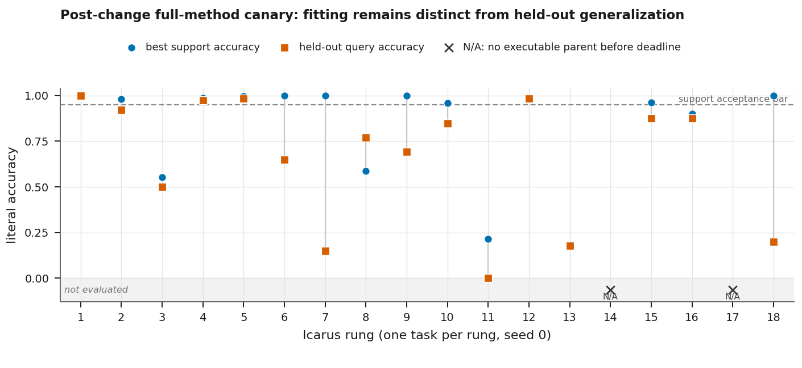

# ArdEVO: Toward Task-General Intelligence with Persistent, Compounding Neuroevolution

**John Gardner**
Ardea AI
john@ardea.io

*Working paper, revised 2026-07-15. The conference core states only claims supported by frozen evidence; the accompanying technical report contains extended methods, tables, diagnostics, and provenance.*

---

## Abstract

Intelligence appears in many forms and substrates, making a complete hand specification of its mechanisms implausible. We investigate a narrower first-principles hypothesis: a task-general learning system should evolve reusable neural structure, preserve verified discoveries, and become cheaper to search as those discoveries compound. ArdEVO is a persistent neuroevolution system built around this hypothesis. Its orchestrator searches a typed library, refines known solutions, routes among frozen experts, evolves network topology, composes prior modules, and recursively decomposes tasks. Gradient descent trains weights inside each structural candidate; evolution controls topology. Verified networks return to a quality-diversity library, while below-threshold champions remain stepping stones.

We evaluate ArdEVO on Icarus, an 18-rung curriculum spanning Boolean functions, control traces, images, scientific modalities, abstract reasoning, and ARC-AGI under one differentiable support/query contract. A historical 400-task lower-ladder run demonstrates compounding: 234 encounters resolved from memory, and retained solutions formed five composition levels. A broader pre-change run completed 180 tasks but exposed substantial support-to-query gaps. A post-change cold canary then completed one task per rung in 6,925.5 task-seconds. It recorded held-out accuracy for 16 of 18 tasks, with mean 0.6626 versus mean support accuracy 0.8312, and grew a 23-entry, six-level library. Routed handoff and recursive recovery executed on wide tasks, but image and ARC results generalized poorly. ARC is cell-level accuracy, not an exact-grid solve.

These results support the viability of one persistent evolutionary loop across heterogeneous modalities. They do not establish task-general intelligence, baseline superiority, reliable upper-rung generalization, recursive self-improvement, or consciousness.

---

## 1 Why Evolve Intelligence?

The full spectrum of intelligence is too broad, internally varied, and substrate-dependent to expect a human designer to specify every useful mechanism directly. Human cognition is itself not a single smooth capability, and biological systems exhibit forms of sensing, control, memory, and collective behavior that do not map cleanly onto a human checklist. Systems assembled from manually selected mechanisms can be powerful, but their competence tends to follow the boundaries of the structures and objectives their designers anticipated. This motivates a different question: can a search process discover, retain, and recombine its own computational structure across tasks?

Evolution is an existence proof for accumulating functional structure without a complete top-down design. It operates through variation, selection, inheritance, and repeated reuse of prior structure. Neuroevolution translates part of that process into neural computation (Stanley and Miikkulainen, 2002; Stanley et al., 2019). The central hypothesis of ArdEVO is not that biological evolution should be copied literally. It is that three of its properties are useful engineering commitments:

1. the representation must be able to grow rather than select only from a fixed catalog;
2. discoveries must persist beyond the task and run that produced them; and
3. later search must be able to reuse, alter, compose, or retire those discoveries.

The long-term aim is a system that is not taught a fixed vocabulary of words, sounds, or visual objects, but can discover structures through which it learns to read, hear, and see. The present system does not reach that aim. It consumes supervised, differentiable tasks with human-provided input and output fields. What it tests is a prerequisite: whether one evolutionary process can operate across heterogeneous task shapes while preserving useful structure and exposing its own failures.

This framing differs from optimizing one model for one benchmark. ArdEVO treats the persistent library, rather than a final champion, as the durable product. A solution can be used as a frozen expert, embedded as a macro, placed inside a larger composition, or selected as a warm seed. Familiar work should become cheap; unfamiliar work should alter the future search distribution. We call this **compounding**. In the current paper, that term has a deliberately narrow meaning: retained artifacts reduce later search cost or provide structure that later search actually uses. It does not mean that the software rewrites itself, invents its own objectives, or improves without an external task stream.

The paper makes three contributions. First, it presents a complete persistent neuroevolution loop that combines structural evolution, gradient-trained weights, routed reuse, hierarchical composition, recursive decomposition, quality-diversity admission, and lifecycle decay under one task-independent interface. Second, it separates search-time support fitting from held-out query reporting and separates measured behavior from post-run engineering changes. Third, it reports evidence from several development eras, culminating in a July 15 canary that exercised the current cross-modal path while revealing that reusable support-fitting structure still does not yield reliable upper-rung generalization.

## 2 Related Work

### 2.1 Growing neural structure

NEAT established a practical recipe for growing topology from minimal networks, protecting new structure through speciation, and aligning crossover with historical markings (Stanley and Miikkulainen, 2002). ArdEVO retains that lineage but assigns weights to a gradient inner loop, writes trained weights back into genomes, and makes a cross-task library the unit of inheritance. This division is Lamarckian in the engineering sense (Whitley et al., 1994): evolution proposes structure, learning evaluates and fills it, and the trained result can survive. The interaction is important because insufficient inner-loop training can cause evolution to discard a structurally promising candidate before its value becomes visible, an instance of the coupling studied by Hinton and Nowlan (1987).

Neural architecture search usually searches a predefined operation space using evolution, reinforcement learning, parameter sharing, or differentiable relaxation (Real et al., 2017, 2019; Liu et al., 2019; Elsken et al., 2019). ArdEVO instead asks whether reusable operations can themselves emerge from a growing graph library. It therefore avoids seeding convolution, attention, or recurrent-cell templates. This is not a claim of prior-free learning: the graph language, mutations, loss contract, curriculum, and resource budgets are all human choices. It is a narrower constraint against task-specific architectural primitives.

Indirect encodings provide a route to repeated structure. CPPNs and HyperNEAT generate large patterns from compact genomes (Stanley, 2007; Stanley et al., 2009), while Weight Agnostic Neural Networks evaluate how much function topology carries under shared weights (Gaier and Ha, 2019). ArdEVO uses direct graph growth in its main path, supports a generative initializer, and records shared-weight robustness as a diagnostic. Its composition strategy is related to CoDeepNEAT's blueprint/module distinction (Miikkulainen et al., 2017), but its modules are executable, typed, previously trained networks rather than layer specifications.

### 2.2 Stepping stones and reusable libraries

Novelty search and quality-diversity methods preserve alternatives that objective-only search would discard (Lehman and Stanley, 2011; Mouret and Clune, 2015; Pugh et al., 2016). Go-Explore makes the related strategy of returning to a retained stepping stone before exploring again explicit (Ecoffet et al., 2021). ArdEVO applies these ideas at two timescales. Within evolution, novelty and wiring cost can participate in multi-objective selection. Across tasks, verified entries occupy behavioral niches, while executable below-threshold champions can seed later attempts.

Program-synthesis systems such as DreamCoder and Stitch build reusable libraries by compressing prior solutions (Ellis et al., 2021; Bowers et al., 2023). Voyager similarly uses a persistent skill library as an anti-forgetting mechanism in an embodied setting (Wang et al., 2023). ArdEVO shares the compounding objective but stores trained neural graphs and compositions rather than symbolic programs or generated code. Its library is both memory and a changing search substrate.

This places the work near open-ended and AI-generating-algorithm research (Clune, 2019; Stanley et al., 2017; Wang et al., 2019, 2020). The current system is not open-ended in the strong sense. Tasks, metrics, and budgets are externally supplied, and every durable artifact must pass a fixed verifier. The relevance is architectural: inheritance, stepping stones, and an expanding vocabulary are mechanisms by which a bounded system could later support a less bounded one.

### 2.3 Routing, modularity, and continual learning

Mixture-of-experts systems learn gates over specialist networks (Jacobs et al., 1991; Shazeer et al., 2017). Modular meta-learning, neural module networks, and soft layer ordering likewise search over reusable computation (Andreas et al., 2016; Alet et al., 2018; Meyerson and Miikkulainen, 2018). ArdEVO's router differs in two ways. Experts are immutable entries accumulated by evolution, and a router score is diagnostic until its behavior is distilled into an executable composition that passes ordinary verification. This prevents a transient adapter from being counted as reusable knowledge.

Continual-learning systems protect weights, expand architectures, or maintain module pools to limit catastrophic forgetting (McCloskey and Cohen, 1989; Rusu et al., 2016; Veniat et al., 2021; Mendez and Eaton, 2021). ArdEVO accepts structural growth as the cost of avoiding destructive interference. Entries are immutable; replacement creates a new entry; references keep dependencies alive; and inactive routes and unreferenced entries can decay and retire. This moves forgetting from uncontrolled parameter drift to an explicit, inspectable lifecycle policy.

## 3 Problem Setting and Honest Evaluation

### 3.1 One contract across heterogeneous tasks

Icarus is an 18-rung curriculum expressed through one typed task contract. A field carries a tensor and descriptors for semantic axes, value type, class count, value range, and padding mask. A task contains support examples for search and a query split for held-out reporting. Descriptor-driven loss dispatch selects cross-entropy, binary cross-entropy, or mean squared error without inspecting the task's name. Structural library signatures derive from field descriptors and widths rather than benchmark identity.

The rungs move from XOR and parity through two-spirals, control traces, MNIST and CIFAR, nine NAS-Bench-360 modalities, RAVEN/PGM-style reasoning, and ARC-AGI (Tu et al., 2022; Barrett et al., 2018; Chollet, 2019). Their flattened widths range from two inputs and one output to millions of inputs and hundreds of thousands of outputs. This diversity stresses more than predictive accuracy. It stresses initialization cost, adapter size, temporal execution, structured placement, routing, and whether one orchestration loop can remain valid as shapes change. The complete rung table appears in the technical supplement.

The ladder is a curriculum, not a proof of generality. It is ordered by intended difficulty, and its task distribution is designed by humans. A run over all rungs demonstrates interface and mechanism coverage only. Comparative capability requires matched baselines and repeated seeds.

### 3.2 Support is for search; query is for evidence

Evolution, routing, composition, and admission use support data. The selected executable artifact receives a held-out query evaluation. **Held-out query accuracy is the primary reported metric.** Support accuracy is shown separately because it measures what search fit, not what generalized. A high support score can therefore produce an accepted runtime outcome while its query score remains poor. We report that discrepancy rather than retroactively redefining the outcome.

Metric availability is literal. A valid accuracy of zero is reported as `0.0000`. `N/A` means that no defensible measurement exists. In the July 15 canary, Psicov and PGM reached their deadlines before an executable parent could be evaluated, so neither support nor query accuracy is imputed. Aggregates exclude unavailable values and retain valid zeroes.

Structured tasks require additional caution. The July 15 ARC row records ordinary encoded support and held-out accuracy, but the archived task row contains no exact-grid, predicted-shape, coverage, or baseline fields. The support path also fell back to literal support accuracy. We therefore describe its 1.0 support and 0.20 query values as cell/sample-level evidence only. They do not constitute an ARC task-exact solve. The same rule applies to the July 12 ARC results, whose mean held-out cell accuracy was 0.5128 and whose best value was 0.84375.

### 3.3 Evidence is tied to code era

ArdEVO changed substantially between the archived campaigns. We use the artifacts as historical evidence, not as if all runs measured the current implementation.

| Evidence era | Scope | What it can support |
|---|---|---|
| July 5-6 lower-ladder studies | repeated tasks on rungs 1-6; dedicated two-spirals diagnostics | compounding behavior, marginal cost, and a representation/training case study under historical configurations |
| July 12 preflight | ten tasks on every rung, 180 total | broader pre-change performance and failure characterization |
| July 15 canary | one task on every rung, cold library, current method | functionality of the post-change path and one observational scorecard |

The July 15 run is not a treatment arm for July 12. It uses a different task sample, task count, codebase, budgets, and library trajectory. Differences between their metrics cannot be assigned to any particular engineering change. Every result in this paper is one seed on one curriculum. The executable Git revision was not pinned contemporaneously in either canary, although configuration and artifacts were frozen.

## 4 The Current ArdEVO Method

### 4.1 The persistent solve loop

Figure 1 summarizes the current task lifecycle. Given a task, the orchestrator first checks structurally compatible library entries. A verified hit can be returned immediately or given a bounded refinement budget. On a miss, the system escalates through routed reuse, a motif-derived grammar, direct topology evolution, and evolution over compositions. If the parent remains unsolved, decomposition creates smaller typed subtasks, solves them recursively, and then retries the parent with the new components available. A verified winner is offered to the library; an executable champion below the acceptance threshold can be retained as a stepping stone.

*Figure 1: The ArdEVO task loop. Search begins from persistent memory, escalates through reuse and structural search, may recurse over typed subtasks, and returns verified artifacts to a lifecycle-managed library. Held-out query evaluation occurs only after search selects an executable artifact.*

This is an orchestration policy, not a cascade of benchmark-specific solvers. Strategies share a task descriptor and a cumulative budget. Unused generations carry forward. Deadlines are checked at durable seams, and each strategy records its own timing, resource estimate, and failure stage. A graceful Escape request follows the same finalization path as normal completion, producing the rolling checkpoint and final reports rather than treating the run as a crash.

### 4.2 Evolving structure and training weights

Direct search begins with a minimal, sparse, factored, or generatively initialized graph. Mutations add and remove nodes and connections, alter activations and aggregation, introduce recurrence or refinement depth, and reference frozen library modules. Speciation protects structural innovations; crossover uses historical identity; multi-objective selection can combine support accuracy, behavioral novelty, and connection cost. Gradient descent trains candidate weights, and Lamarckian writeback returns trained values to the genome.

The split is deliberate. Pure weight mutation was ineffective even on low rungs in early experiments, while gradient training provides a common optimizer across field types. Evolution is reserved for discrete structure and search strategy. Shared-weight samples measure whether a topology carries useful function independently of its fitted weights, but are a diagnostic and quality signal rather than a substitute for held-out evaluation.

Composition evolution searches graphs whose vertices can be prior modules. Fixed port maps join mismatched interfaces with compact axis- and shape-derived index runs. Four generic maps are available: output slices, input subsets, time windows, and spatial patches. Execution gathers selected values and scatters them into the target placement. These maps remain fixed through serialization, mutation, crossover, writeback, nested composition, and resource estimation. This replaced dense, mostly zero glue that made wide decomposition both expensive and role-limited.

### 4.3 Routing and executable handoff

The routed strategy learns sparse top-k paths over the complete set of library vertices. Experts remain frozen; small gate embeddings remain resident; wide input adapters, output heads, and selected expert state load on demand. Router format v2 shards those components so state scales with active use rather than requiring every wide tensor to remain resident.

A router score alone is never an admission. The selected pathway must distill into an executable composition. If distillation falls below the acceptance threshold but still produces a valid artifact, that artifact is deduplicated and handed to ordinary composition as a warm seed. The strategy ledger records router score, distilled score, their gap, handoff count, and any recovery score. Metric-only router results remain diagnostics. This distinction matters in the canary: routed paths often identified useful experts, while parent execution still required composition or decomposition to recover.

### 4.4 Persistent memory, identity, and decay

Library entries are immutable modules or compositions. They are indexed by structural signatures and behavior niches, and may refer to older entries as dependencies. Two identities serve different purposes. Content identity prevents duplicate serialized artifacts; topology identity ignores fitted parameter values and prevents exact structural proposals from consuming repeated evaluation budget. The topology tabu is scoped to the relevant search context so that a known structure can still be retrained when the intended experiment requires it.

Usage is not permanent entitlement. Router edges decay when they stop carrying traffic. Vertices whose routes disappear become inactive; inactive, unreferenced library entries can then retire after their configured grace period. Garbage collection removes only artifacts that are both retired and unreachable. The full overmind render preserves historical cards, while the pruned render packs current entries into the same eight-column grid for direct comparison. This two-stage policy makes removal algorithmic and auditable rather than allowing the library to grow without pressure.

### 4.5 Reporting and provenance

The runtime display reports conceptual stage transitions and always closes each task with support and held-out query status. Machine-readable attempts retain the detailed metrics without flooding the terminal. Every durable summary update atomically refreshes a schema-versioned JSON report, a Markdown report, and a per-rung CSV. Missing and zero metrics remain distinct.

Runs snapshot the source and effective configurations with hashes. External archives use content-addressed manifests so unchanged run, library, and router objects are uploaded once; restore verifies hashes before atomic installation. The technical report records resource accounting, historical incidents, and artifact provenance in detail.

## 5 Evidence Eras and Experimental Protocol

All reported campaigns used seed 0 on one Apple M4 Max with 128 GB unified memory and CPU-resident search. The total recorded task wall clock across the cited campaigns is approximately 21.9 hours. This is an accounting total, not a hardware-normalized compute comparison.

The historical lower-ladder run began from an empty library and interleaved 400 task encounters over rungs 1-6. Its configuration predates the current full-method profile, but it remains the clearest repeated-task test of compounding because each solved family appears many times. The two-spirals studies used repeated assaults and controlled configuration flips to diagnose why retained structure did not cross the acceptance threshold.

The July 12 preflight scheduled ten tasks from each of the 18 rungs. It completed all 180 tasks in 49,311.5 seconds and 3,987 generations. Outcomes were 74 evolved, 64 failed, 36 library hits, 4 refinements, and 2 decompositions. Held-out metrics were recorded for 137 tasks. The run created 84 entries and retained 69 after garbage collection. It predates compact port maps, executable routed handoff, router v2 sharding, lifecycle decay, topology tabu, and the current reporting semantics. We use it to characterize scale and generalization gaps, not to validate those later changes.

The July 15 canary used the current canary profile, a cold library, and one task per rung. It was intended to exercise the deepest available path on each modality while bounding total runtime. It completed 18 of 18 tasks, ran 720 generations, and recorded 6,925.5 task-seconds. The one-task sample makes per-rung results illustrative rather than estimates of rung-level performance.

In all result tables, runtime outcome labels describe what the orchestrator did under its support-side rules. They are not substitutes for query success. For example, a task may be recorded as `evolved` because an executable support-side champion was admitted while its held-out accuracy is low. We therefore lead with query results and report mechanisms separately.

## 6 Measured Results

### 6.1 Repeated tasks compound on the lower ladder

The historical cold 400-task run attempted every scheduled task, consumed 15,590 generations and 10,198 task-seconds, and ended with 49 entries before garbage collection and 35 after. Rungs 1, 2, 4, and 5 solved 266 of 267 encounters under that run's historical acceptance semantics. Rungs 3 and 6 remained unsolved at best metrics 0.901 and 0.900 against a 0.95 threshold.

The relevant result is the change in marginal work. Of 400 encounters, 217 were direct library hits and 17 were hits that strictly improved under bounded refinement. Only 32 encounters required a fresh evolutionary solve. Forty-six refinement attempts yielded 17 improvements; 188 later refinement opportunities were skipped by the decayed cooldown. The final retained graph contained live entries through level 5, showing that compositions of compositions arose without a prescribed depth schedule. Every later two-spirals or MNIST-family assault warm-started from a retained stepping stone.

*Figure 2: Historical marginal task cost in the cold 400-task run. Filled points are encounters resolved from memory, open triangles are fresh solves, and crosses are failures. Repeated solved families fall from evolutionary search to millisecond or bounded-refinement retrieval; unsolved families continue to pay search cost.*

This is evidence that persistent memory can reduce repeated-task cost. It is not yet a clean causal estimate of the entire library mechanism because the run has one seed and no matched fresh-per-task control. Those controls remain part of the planned campaign.

### 6.2 The broad pre-change run exposed generalization gaps

The July 12 preflight demonstrated that one historical loop could execute all 18 rungs, but support fitting frequently failed to transfer. ARC support averaged 0.9994 while held-out cell accuracy averaged 0.5128. PGM support averaged 1.0 while query averaged 0.1077. Image rungs also showed large gaps. The run's 48 deadline events concentrated in upper rungs, and its router state grew to 5.3 GiB. These observations motivated compact parent wiring, explicit routed handoff, sharded router storage, and more literal reporting.

The scientific conclusion is negative but useful: a reusable support-fitting system did not thereby acquire reliable upper-rung generalization. The run also provides no matched baseline, exact-grid ARC metric, or pinned executable revision. Its full 18-row table and postmortem appear in the technical supplement.

### 6.3 The current-method canary exercised the current path

The July 15 run recorded held-out accuracy for 16 of 18 root tasks. Across those 16, mean query accuracy was 0.6626. Mean support accuracy across available root measurements was 0.8312, and the mean paired support-minus-query gap was 0.1686. A zero-valued spherical query is included; Psicov and PGM are unavailable rather than treated as zero. Runtime outcomes were 9 evolved, 2 decomposed, and 7 failed.

*Figure 3: July 15 support and held-out query accuracy by rung. A zero query score is plotted as a valid measurement. Psicov and PGM are marked unavailable because their deadlines arrived before executable parent evaluation. Values are one task per rung, not rung-level estimates.*

The lower and control rungs generalized strongly in this sample: XOR reached 1.0 query accuracy; parity 0.9231; pole 0.9750; and double-pole 0.9833. Cosmic was the strongest wide structured example, with 0.9848 support and 0.9837 query accuracy after decomposition. FSD50K recorded 0.9615 support and 0.8742 query, and DeepSEA 0.8998 and 0.8761.

The gaps remain the dominant result. MNIST recorded 1.0 support and 0.65 query. CIFAR recorded 1.0 and 0.15. Satellite recorded 1.0 and 0.6923. The ARC task recorded 1.0 support and 0.20 held-out cell/sample accuracy. No exact-grid, shape, coverage, or baseline measurement was present, so this is not an ARC solve. Two-spirals remained near chance at 0.5515 support and 0.50 query. Spherical's valid query value was 0.0. Psicov and PGM produced neither support nor query measurements before their deadlines.

The cold library grew from 0 to 23 entries: 7 modules and 16 compositions, with one level-6 entry. No entry was retired or collected. The run recorded no root refinement outcome and no root library-hit outcome, as expected from one cold encounter per rung, so those current mechanisms were not evaluated by this canary.

### 6.4 What the mechanism traces show

Routed-to-composition handoff occurred five times at root level; two roots, Cosmic and ARC, later recorded recovery results. Including recursive subtasks, the run recorded nine handoffs and five recoveries. Cosmic and ARC ended as decomposition outcomes, demonstrating that compact selection/placement, recursion, routed diagnostics, and executable parent recovery can coexist on very wide structures. This is mechanism execution evidence, not evidence that routing caused their query scores.

Five root tasks hit a deadline marker. Deadline enforcement is cooperative at generation and strategy seams, so an expensive unit can overshoot its nominal boundary before control returns. Psicov and PGM ended with `time_limit_before_evaluation`, which is why their metrics are unavailable. Three route edges expired during the run, exercising edge decay, but no router vertex or library entry reached retirement. Router v2 persisted a small core plus shards, demonstrating the storage layout; eager-versus-sharded parity is established by tests rather than by this scorecard.

## 7 Observed, Tested, and Pending Mechanisms

The distinction between an implemented mechanism and an empirically supported mechanism is essential in a rapidly changing research system.

| Mechanism | Current evidence status |
|---|---|
| Persistent lookup and refinement | Observed repeatedly in the historical lower-ladder run; not exercised at root level by the cold July 15 one-task schedule |
| Hierarchical compositions | Observed through level 5 historically and level 6 in July 15 |
| Compact port maps and recursive placement | Executed in July 15 decomposition paths; exact gather/scatter behavior is regression-tested |
| Routed executable handoff | Observed in July 15 traces, including recoveries; causal performance benefit unmeasured |
| Router v2 sharding | Persisted in July 15; numerical parity and v1 migration are regression-tested |
| Route and library decay | Three route edges expired; vertex retirement, entry retirement, and GC were not exercised in July 15 and remain test-backed |
| Topology tabu and duplicate suppression | Implemented and regression-tested; July 15 counters show no topology census, so no canary compute saving is claimed |
| Motif discovery | Raw historical census is descriptive; null-graph and counterfactual labels are implemented, but July 15 produced no discovery study |
| Content-addressed external archives | Deduplication, verified restore, and v1 compatibility are test-backed; not a predictive result |
| Graceful Escape shutdown and paired renders | Operational features covered by tests; the completed July 15 run did not need graceful shutdown |

The current motif vocabulary deserves particular restraint. Frequent subgraphs are useful grammar candidates, but frequency alone is not architectural discovery. The discovery pipeline now compares candidates with 64 deterministic label/degree-preserving null graphs, independent lineage support, within-signature performance, robustness, and reuse. Candidates must be locked from support/library evidence before query results are read. A candidate is `observed` only with structural surprise and positive performance association, `functional` only after a frozen edge knockout exceeds matched controls, and `replicated` only after functional evidence appears in two independent lineage roots. No new cell, convolution, or architectural invention is claimed here.

The next evidentiary step is not another one-task canary. It is the pre-registered, multi-seed full-cluster and ablation campaign: matched full versus no-library, no-routing, no-decomposition, no-hierarchy, and no-refinement arms; fresh-per-task controls; and external MLP, NEAT, WANN-style, and random-structure baselines under comparable budgets. The repository contains the runners and configurations, but tooling is not a result.

## 8 Discussion

### 8.1 What the evidence supports

The strongest claim is architectural. One persistent system executed a common task contract from XOR to ARC, grew a multi-level library, used prior entries as routed experts and composition components, recursively decomposed wide tasks, and preserved enough state to make later search structurally different from earlier search. On repeated lower-rung families, memory reduced marginal task cost by orders of magnitude. The July 15 canary shows that the current method still executes after substantial changes to parent wiring, routed handoff, persistence, and lifecycle management.

This matters because task-general search needs more than a learner that can be reset for each benchmark. It needs an inheritance mechanism. ArdEVO offers one concrete answer: immutable neural artifacts, typed interfaces, verified composition, and explicit decay. The library makes accumulated structure inspectable and prevents new training from silently overwriting old solutions.

### 8.2 What the evidence does not support

Cross-modal execution is not cross-modal mastery. The image and ARC gaps show that high support accuracy can coexist with weak held-out behavior. Reusable structure has so far amplified fitting more reliably than generalization. The current system also depends on a human curriculum, supervised targets, descriptor-defined losses, and externally selected acceptance thresholds. It has not learned its own task distribution or evaluation criteria.

The no-task-specific-primitives constraint creates a real tradeoff. Supplying convolution or a Fourier basis would likely improve particular rungs, but would answer a different question. ArdEVO instead searches for reusable primitives through generic graph operations, geometry, composition, and selection pressure. That choice makes negative results central: if repeated structure remains expensive or candidate training is too short to reveal a good genotype, the system must expose the failure rather than hide it behind a hand-built module. The two-spirals case study in the supplement is one example.

### 8.3 Recursive improvement, narrowly construed

Persistent evolution creates a natural route to cumulative improvement: discoveries change the components, warm starts, and search paths available to subsequent tasks. In that limited sense, the process is recursively productive. The current implementation is not recursive self-improvement in the stronger sense used for systems that modify their own code, objectives, training algorithm, evaluator, or task generator. It evolves neural artifacts inside a fixed program. Claims beyond that boundary require a different experiment and substantially stronger safety analysis.

### 8.4 Long-horizon motivation: agency and consciousness

The broader research motivation is artificial agency capable of developing rich internal object representations and, eventually, properties associated with subjectivity or consciousness. Evolution is relevant because biological agency and experience arose through cumulative adaptation rather than direct mechanism-by-mechanism engineering. A system that can discover its own perceptual and cognitive primitives may therefore be a more plausible component of that long-range program than one whose entire ontology is specified in advance.

Nothing in the present experiments measures qualia, objectness, selfhood, sentience, or consciousness. Benchmark accuracy, persistent memory, autonomous topology growth, and even future recursive self-modification would not by themselves establish any of those properties. ArdEVO should be evaluated here as a bounded search and memory system. Consciousness is a motivating destination, not an empirical contribution of this paper, and complementary systems and operational measures would be required before the question becomes scientifically testable.

## 9 Limitations

**Single seed and curriculum dependence.** All reported campaigns use seed 0. Repeated encounters within one run are not independent samples, and the ladder ordering influences what enters the library. Confidence intervals, curriculum randomization, and matched cold/warm controls are pending.

**No matched external baselines.** ArdEVO has not yet been compared under equal budgets with a fixed MLP, canonical NEAT, WANN-style search, or random topology search on this contract. The current evidence supports internal behavior claims, not superiority.

**Historical/current boundary.** July 12 predates many current mechanisms. July 15 uses one task per rung and cannot isolate which change affected any metric. Neither canary pins an executable Git revision. Configuration hashes and archived artifacts reduce but do not remove this reproducibility gap.

**Generalization and metric limits.** The mean July 15 support-query gap was 0.1686, with severe image and ARC failures. ARC is reported only at the encoded cell/sample level, not exact-grid. Psicov and PGM have no root metrics. Task-specific baselines and structured shape/coverage fields were not recorded contemporaneously.

**Mechanism coverage.** July 15 did not exercise root library hits, refinement, topology duplicate counters, vertex retirement, library retirement, garbage collection, or motif counterfactuals. Those features are supported by tests or historical runs, not by this canary.

**Resource and deadline semantics.** Very wide adapters and compositions remain expensive. Cooperative deadlines can overshoot inside a generation. Router sharding reduces residency but does not reduce the mathematical width of a selected adapter or head.

**Bounded objective.** The system learns supervised mappings under human-defined descriptors and losses. It does not choose its own goals, operate an open-ended environment, rewrite its implementation, or provide evidence about consciousness.

## 10 Conclusion

ArdEVO begins from a simple premise: if intelligence cannot be specified mechanism by mechanism, a useful research system should search for its own structure and preserve what it finds. The resulting architecture couples topology evolution with gradient-trained weights, places verified neural artifacts in persistent memory, composes and routes those artifacts across tasks, and retires them through explicit lifecycle rules.

The evidence is promising and incomplete. Repeated lower-rung tasks became dramatically cheaper after their first solution, and multi-level reuse emerged. A broad historical run exposed serious support-to-query gaps. The July 15 current-method canary completed every rung, exercised routed handoff and recursive parent recovery, and grew a six-level library, while again showing weak generalization on images and ARC. That combination is the honest result: the persistent evolutionary substrate works across modalities, but it has not yet turned accumulated structure into reliable task-general competence.

The path forward is empirical. Multi-seed ablations must isolate which memory and search mechanisms matter; external baselines must establish whether evolution earns its cost; exact structured metrics must replace proxies; and future systems must distinguish cumulative library search from genuine self-modification. ArdEVO provides a testable platform for those questions, not their final answer.

---

## Acknowledgments

The Icarus dataset is generated and maintained separately at github.com/ArdeaAI/Icarus-Dataset. Portions of the engineering were carried out with AI pair-programming assistance; all design decisions, constraints, and evaluations are the author's.

---

## References

Alet, F., Lozano-Perez, T., and Kaelbling, L. P. (2018). Modular meta-learning. *Conference on Robot Learning (CoRL)*. arXiv:1806.10166.

Andreas, J., Rohrbach, M., Darrell, T., and Klein, D. (2016). Neural module networks. *CVPR 2016*. arXiv:1511.02799.

ARC Prize Foundation (2026). ARC-AGI-3: A new challenge for frontier agentic intelligence. arXiv:2603.24621.

Barrett, D. G. T., Hill, F., Santoro, A. S., Morcos, A. S., and Lillicrap, T. (2018). Measuring abstract reasoning in neural networks. *ICML 2018*. arXiv:1807.04225.

Bowers, M., Olausson, T. X., Wong, L., Grand, G., Tenenbaum, J. B., Ellis, K., and Solar-Lezama, A. (2023). Top-down synthesis for library learning. *POPL 2023*. arXiv:2211.16605.

Chollet, F. (2019). On the measure of intelligence. arXiv:1911.01547.

Clune, J. (2019). AI-GAs: AI-generating algorithms, an alternate paradigm for producing general artificial intelligence. arXiv:1905.10985.

Ecoffet, A., Huizinga, J., Lehman, J., Stanley, K. O., and Clune, J. (2021). First return, then explore. *Nature*, 590:580-586.

Ellis, K., Wong, C., Nye, M., Sable-Meyer, M., Cary, L., Morales, L., Hewitt, L., Solar-Lezama, A., and Tenenbaum, J. B. (2021). DreamCoder: Bootstrapping inductive program synthesis with wake-sleep library learning. *PLDI 2021*. arXiv:2006.08381.

Elsken, T., Metzen, J. H., and Hutter, F. (2019). Neural architecture search: A survey. *JMLR*, 20(55):1-21. arXiv:1808.05377.

Gaier, A., and Ha, D. (2019). Weight agnostic neural networks. *NeurIPS 2019*. arXiv:1906.04358.

Hinton, G. E., and Nowlan, S. J. (1987). How learning can guide evolution. *Complex Systems*, 1(3):495-502.

Jacobs, R. A., Jordan, M. I., Nowlan, S. J., and Hinton, G. E. (1991). Adaptive mixtures of local experts. *Neural Computation*, 3(1):79-87.

Lehman, J., and Stanley, K. O. (2011). Abandoning objectives: Evolution through the search for novelty alone. *Evolutionary Computation*, 19(2):189-223.

Liu, H., Simonyan, K., and Yang, Y. (2019). DARTS: Differentiable architecture search. *ICLR 2019*. arXiv:1806.09055.

McCloskey, M., and Cohen, N. J. (1989). Catastrophic interference in connectionist networks: The sequential learning problem. *Psychology of Learning and Motivation*, 24:109-165.

Mendez, J. A., and Eaton, E. (2021). Lifelong learning of compositional structures. *ICLR 2021*. arXiv:2007.07732.

Meyerson, E., and Miikkulainen, R. (2018). Beyond shared hierarchies: Deep multitask learning through soft layer ordering. *ICLR 2018*. arXiv:1711.00108.

Miikkulainen, R., Liang, J., Meyerson, E., Rawal, A., Fink, D., Francon, O., Raju, B., Shahrzad, H., Navruzyan, A., Duffy, N., and Hodjat, B. (2017). Evolving deep neural networks. arXiv:1703.00548.

Mouret, J.-B., and Clune, J. (2015). Illuminating search spaces by mapping elites. arXiv:1504.04909.

Pugh, J. K., Soros, L. B., and Stanley, K. O. (2016). Quality diversity: A new frontier for evolutionary computation. *Frontiers in Robotics and AI*, 3:40.

Real, E., Aggarwal, A., Huang, Y., and Le, Q. V. (2019). Regularized evolution for image classifier architecture search. *AAAI 2019*. arXiv:1802.01548.

Real, E., Moore, S., Selle, A., Saxena, S., Suematsu, Y. L., Tan, J., Le, Q., and Kurakin, A. (2017). Large-scale evolution of image classifiers. *ICML 2017*. arXiv:1703.01041.

Rusu, A. A., Rabinowitz, N. C., Desjardins, G., Soyer, H., Kirkpatrick, J., Kavukcuoglu, K., Pascanu, R., and Hadsell, R. (2016). Progressive neural networks. arXiv:1606.04671.

Shazeer, N., Mirhoseini, A., Maziarz, K., Davis, A., Le, Q., Hinton, G., and Dean, J. (2017). Outrageously large neural networks: The sparsely-gated mixture-of-experts layer. *ICLR 2017*. arXiv:1701.06538.

Stanley, K. O. (2007). Compositional pattern producing networks: A novel abstraction of development. *Genetic Programming and Evolvable Machines*, 8(2):131-162.

Stanley, K. O., Clune, J., Lehman, J., and Miikkulainen, R. (2019). Designing neural networks through neuroevolution. *Nature Machine Intelligence*, 1:24-35.

Stanley, K. O., D'Ambrosio, D. B., and Gauci, J. (2009). A hypercube-based encoding for evolving large-scale neural networks. *Artificial Life*, 15(2):185-212.

Stanley, K. O., Lehman, J., and Soros, L. (2017). Open-endedness: The last grand challenge you've never heard of. *O'Reilly Radar*.

Stanley, K. O., and Miikkulainen, R. (2002). Evolving neural networks through augmenting topologies. *Evolutionary Computation*, 10(2):99-127.

Tu, R., Roberts, N., Khodak, M., Shen, J., Sala, F., and Talwalkar, A. (2022). NAS-Bench-360: Benchmarking neural architecture search on diverse tasks. *NeurIPS 2022 Datasets and Benchmarks*. arXiv:2110.05668.

Veniat, T., Denoyer, L., and Ranzato, M. (2021). Efficient continual learning with modular networks and task-driven priors. *ICLR 2021*. arXiv:2012.12631.

Wang, G., Xie, Y., Jiang, Y., Mandlekar, A., Xiao, C., Zhu, Y., Fan, L., and Anandkumar, A. (2023). Voyager: An open-ended embodied agent with large language models. arXiv:2305.16291.

Wang, R., Lehman, J., Clune, J., and Stanley, K. O. (2019). Paired open-ended trailblazer (POET): Endlessly generating increasingly complex and diverse learning environments and their solutions. arXiv:1901.01753.

Wang, R., Lehman, J., Rawal, A., Zhi, J., Li, Y., Clune, J., and Stanley, K. O. (2020). Enhanced POET: Open-ended reinforcement learning through unbounded invention of learning challenges and their solutions. *ICML 2020*. arXiv:2003.08536.

Whitley, D., Gordon, V. S., and Mathias, K. (1994). Lamarckian evolution, the Baldwin effect and function optimization. *PPSN III*, LNCS 866, 6-15.
