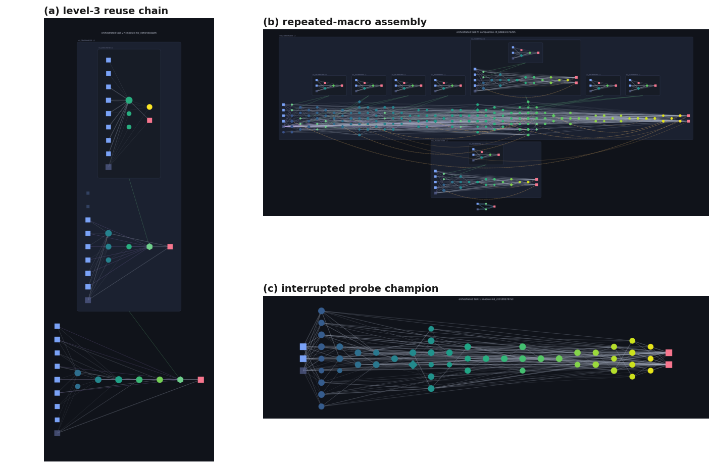

## Technical Supplement

This supplement accompanies **Versal: Toward Task-General Intelligence with Persistent, Compounding Neuroevolution**. It retains the extended task contract, method details, historical experiments, complete rung tables, engineering postmortems, and reproducibility notes that are intentionally compressed in the conference core. Claims inherit the evidence boundary stated in the core: historical runs describe the code that produced them, current mechanisms are not credited with retroactive effects, and regression-tested behavior is not presented as measured campaign performance.

## Appendix A: Icarus Task Contract

### A.1 Fields, tasks, and encoders

A **Field** contains a tensor plus the descriptors required to interpret it: semantic `axes` drawn from EXAMPLE, CHANNEL, TIME, HEIGHT, WIDTH, DEPTH, and EXTRA; a value type drawn from BINARY, CATEGORICAL, MULTILABEL, CONTINUOUS, and ORDINAL; a class count where applicable; an optional continuous range; and an optional padding mask. A **Task** contains non-empty support and query lists of input/output field pairs. Authoritative native splits are preserved. Other tasks receive deterministic splits from a stable task-derived seed.

Loss dispatch uses the output descriptor rather than the benchmark name. Categorical and ordinal fields use cross-entropy, binary and multilabel fields use binary cross-entropy with logits, and continuous fields use mean squared error. Masks weight every path consistently. The Level0 encoder flattens fields to `[batch, width]`, normalizes continuous values, and clears padded positions. Temporal encoding reconstructs the TIME axis and is equivalent to Level0 when the time extent is one.

Library signatures derive from value type, semantic axes, and flattened width. They deliberately exclude the task name and rung. This permits structural compatibility across datasets while preventing benchmark labels from becoming lookup keys. It does not guarantee semantic transfer between same-shaped tasks; every candidate is re-evaluated on support before use.

### A.2 Complete rung inventory

| Rung | Family | Available tasks | Flattened input to output | Role in the ladder |
|---:|---|---:|---|---|
| 1 | XOR | 1 | BINARY 2 to BINARY 1 | smallest topology-growth test |
| 2 | parity n4-n8 | 9 | BINARY up to 8 to BINARY 1 | discrete generalization |
| 3 | two-spirals | 1 | CONTINUOUS 2 to CATEGORICAL 2 | nonlinear representation wall |
| 4 | pole | 39 | CONTINUOUS 4 per step to 1 | temporal control traces |
| 5 | double-pole | 39 | CONTINUOUS 6 per step to 2 | harder temporal traces |
| 6 | MNIST / Fashion-MNIST | 1,200 | CONTINUOUS 784 to CATEGORICAL 10 | first image statistics |
| 7 | CIFAR | 1,000 | CONTINUOUS 3,072 to CATEGORICAL 10 | wider image statistics |
| 8 | ECG | 1,287 | CONTINUOUS 1,000 to CATEGORICAL 4 | NAS-Bench-360 temporal task |
| 9 | Satellite | 15,625 | CONTINUOUS 46 to CATEGORICAL 24 | NAS-Bench-360 temporal task |
| 10 | NinaPro | 62 | CONTINUOUS 832 to CATEGORICAL 18 | NAS-Bench-360 temporal task |
| 11 | Spherical | 938 | CONTINUOUS 10,800 to CATEGORICAL 100 | wide spherical image task |
| 12 | Cosmic | 512 | CONTINUOUS 65,536 to BINARY 65,536 | dense structured output |
| 13 | Darcy Flow | 32 | CONTINUOUS 177,241 to CONTINUOUS 177,241 | dense field regression |
| 14 | Psicov | 58 | CONTINUOUS 271k to at least 13.97M to CONTINUOUS 4.8k to at least 245k | variable, extremely wide structures |
| 15 | FSD50K | 12,529 | CONTINUOUS 5,632 to MULTILABEL 200 | audio multilabel task |
| 16 | DeepSEA | 3,489 | CONTINUOUS 4,000 to MULTILABEL 36 | temporal genomics task |
| 17 | RAVEN / PGM | 23,294 | CONTINUOUS 409,600 to CATEGORICAL 8 | abstract relational reasoning |
| 18 | ARC-AGI | 800 | CATEGORICAL 900 to CATEGORICAL 9,000 | structured program-induction target |

Counts and widths were enumerated from the published dataset during the historical evidence freeze. The Psicov range is intentionally open-ended: the July 12 run observed a 13,966,425-input by 245,025-output task beyond the earlier probe range. Flattened widths describe the library-facing Level0 view; temporal substrates recover step structure where applicable.

The dataset is generated in a separate repository and published as `Ardea/Icarus-dataset`. Versal vendors only the loader/encoder runtime. Rungs 4 and 5 originate from policy rollouts but are stored and evaluated as supervised traces. No interactive environment is present in the consumer. The rung scheduler is checkpointable and normally interleaves rungs so that library state changes between families.

### A.3 Structured outputs and metric availability

Variable-size structured targets require alignment between the support-derived head and query target. Generic tasks use a fixed-width masked representation. ARC support and query grids are placed in a two-dimensional canvas, and a separate support-fitted shape mechanism can report predicted dimensions and coverage when those fields are enabled. Unrepresented target cells count as incorrect.

Neither the July 12 nor July 15 ARC artifact contains a contemporaneous exact-grid result. The July 15 root row also lacks task-specific shape, coverage, and baseline fields. Its reported `support_accuracy = 1.0` and `report_metric = 0.20` are literal encoded-cell/sample accuracies. Any table or figure that calls this an ARC solve would be false. `N/A` has a similarly strict meaning: the evaluator had no executable root artifact from which to obtain the metric. It is never a rendered form of zero.

## Appendix B: Current Search and Memory System

### B.1 Orchestration state machine

The current root task sequence is:

`lookup -> optional refinement -> routed reuse -> grammar -> direct evolution -> composition evolution -> decomposition/retry -> admission or stepping stone`

Each stage consumes part of a cumulative generation and wall-time ledger. A strategy can return a verified accepted artifact, an executable below-threshold artifact, a diagnostic metric without an artifact, a resource decline, or a failure. Only executable artifacts may seed later structural stages or enter the library. A router score without successful distillation remains diagnostic.

Recursive tasks use the same state machine at a deeper depth. Decomposition is considered only when the remaining budget and operator-specific solvability checks justify it. A parent is not counted as solved merely because its subtasks solve. Newly admitted subtask artifacts expand the module pool, after which the parent must execute and verify.

Every attempt records outcome, strategy, generation count, support metric, held-out status at the root, stage timing, failure stage, candidate size, resource estimates, and strategy-specific metrics. Run summaries and checkpoints are replaced atomically at every durable boundary. A graceful Escape request is checked through the same cooperative seams and uses normal finalization; Ctrl-C remains a crash path.

### B.2 Graph genome and phenotype

The leaf representation extends a NEAT-lineage graph. Node genes carry activation and aggregation behavior, recurrent state where enabled, iterative refinement depth, and optional references to immutable library entries. Connection genes carry historical identity, endpoint identity, enablement, and trainable weight state. Innovation numbering aligns crossover and allows speciation distance to track structural change.

Mutations include adding and removing nodes or connections, changing activation and aggregation, toggling recurrence, changing refinement depth, geometric rewiring, and inserting library modules. Self-adaptive variants mutate and inherit their own operator rates. Initialization can be minimal, factored, sparse, or generated from a compact pattern-producing network. These are generic graph operations; none is a prebuilt convolution, attention block, or benchmark-specific cell.

The trainer owns weights. Candidate graphs are differentiated with respect to the support objective, and trained weights write back into the genome. Direct and composition populations can use different schedules and population execution paths while sharing the field-driven loss contract. Scheduled training, population batching, and device selection are configuration choices, not separate task solvers.

The evaluator reports trained support accuracy and loss, optional shared-weight samples, behavior descriptors, and structural size. Shared-weight robustness is inspired by weight-agnostic evaluation: every trainable weight receives the same scalar for each sample, and the best/mean response estimates how much function is expressed by topology alone. It is useful for diagnostics and archive quality but is not comparable across every output metric and is never the held-out headline.

### B.3 Composition and compact port maps

A composition genome selects frozen library entries and fixed connectors. The connector does not store a dense mostly-zero matrix. It stores axis- and shape-derived index runs sufficient to reconstruct one of four generic relations:

- `output_slice`: select a bounded region of a producer output;
- `input_subset`: place values into selected consumer inputs;
- `time_window`: select or place a contiguous temporal interval; and
- `spatial_patch`: select or place a rectangular spatial region.

Forward execution uses gather and scatter operations. Shape validation occurs before allocation. The same fixed maps survive serialization, crossover, mutation of the surrounding composition, Lamarckian writeback, nesting, and resource estimation. Resource estimates charge the compact representation and actual resident population rather than an imagined dense matrix.

The decomposition operators produce exactly these maps, so a child solution can become an ordinary module rather than a special task-local object. Output slices, input subsets, time windows, and spatial patches therefore share one parent-wiring representation.

### B.4 Routed reuse and sharded persistence

The router maintains an embedding for every active library vertex and chooses top-k experts over the complete vertex set. It can unroll several routed steps, use learned halting, and account for transition traffic. Experts remain frozen. Task-specific adapters and heads translate between the task signature and router latent space.

In format v2, the small gate/core state is separate from three shard classes: per-vertex state, input adapters, and output heads. All gate embeddings remain resident, while selected experts and the current/replay task signatures load on demand. Newly activated parameters are added to the optimizer dynamically, and eviction occurs only between optimizer steps. The July 15 archive contains a 105,020-byte core file and approximately 287 MiB of shards. This demonstrates the persisted layout, not a runtime memory benchmark. Numerical equality with eager loading and non-destructive v1 migration are regression-tested.

Distillation converts a soft routed path into a fixed composition. If the router clears its diagnostic bar but the distilled result falls below acceptance, a valid distilled artifact is handed to ordinary composition as a deduplicated warm seed. July 15 root rows record five such handoffs and two eventual parent recoveries. Across nested rows there were nine handoffs and five recoveries.

### B.5 Library identity, admission, and lifecycle

An entry contains its immutable payload, structural I/O signature, behavior descriptor, accepted metric, robustness statistics, composition level, dependency references, and lifecycle metadata. Content hashes deduplicate byte-identical artifacts. A separate canonical topology hash ignores trained parameter values and is used by the search-time tabu to reject exact structural repeats before expensive retraining. The tabu is scoped and bounded so deliberate retraining experiments can opt out.

Admission is a quality-diversity archive rather than an unbounded top-k list. Entries compete within compatible signature and behavior niches. Dominated replacements create tombstones instead of overwriting files because live compositions may still reference an older payload. The dependency graph determines reachability.

Lifecycle pressure begins in the router. Edge traffic decays by epoch; edges at zero expire. A vertex without viable routes ages toward eviction. The library separately tracks task activity; an inactive and unreferenced entry can retire after a grace interval. Garbage collection removes only retired, unreachable payloads. The full overmind image includes historical retired cards, while `overmind_pruned.png` removes them and repacks current cards into the same eight-column layout.

### B.6 Grammar and motif evidence

The raw motif census canonicalizes small subgraphs and counts their occurrences. It remains useful for proposing grammar productions, but it is descriptive. Frequency can be dominated by input/output plumbing, common degree patterns, or repeated ancestry.

Discovery ranking therefore excludes pure plumbing and compares candidates against 64 deterministic label/degree-preserving null graphs. It combines structural surprise, independent lineage support, performance percentile within structural signature, robustness percentile, and reuse percentile. Candidates are locked using support and library evidence before query results are read. Up to three exemplars of each of the top ten candidates receive a frozen edge knockout and at most 25 configured recovery steps, compared with 16 matched edge-control interventions.

Evidence labels are deliberately conservative:

- `observed`: surprise z-score at least 2 and a positive performance association;
- `functional`: accuracy falls at least 0.02 and the intervention is worse than 95% of matched controls; and
- `replicated`: functional evidence occurs in at least two independent lineage roots.

The historical atlas does not meet these criteria and is not evidence of a new cell or architectural invention.

## Appendix C: Evidence Eras and Reproducibility Protocol

### C.1 Frozen experiments

| Experiment | Historical purpose | Seed | Initial library |
|---|---|---:|---|
| July 6 400-task lower ladder | repeated-task compounding over rungs 1-6 | 0 | cold |
| July 5 G0 two-spirals | scalar-selection baseline | 0 | cold |
| July 5 G1 two-spirals | novelty/NSGA-II/wiring-cost flip | 0 | cold |
| July 5 G1 continuation | repeated search with surviving G1 library | 0 | warm |
| July 5-6 probe and snapshot | generative/scheduled-training probe and stone-seeded lower ladder | 0 | cold probe; one-stone snapshot |
| July 12 preflight | ten tasks per rung across all 18 rungs | 0 | cold |
| July 15 canary | current method, one task per rung | 0 | cold |

The authoritative protocol for each row is the configuration frozen beside its result. Repository defaults changed between runs and must not be projected backward. All campaigns used one Apple M4 Max with 128 GB unified memory and CPU-resident search. Hardware similarity does not make the configurations or samples comparable.

The evidence manifest pins each cited artifact by SHA256. New runs snapshot the leaf configuration, every inherited source digest, the canonical effective configuration, and a hardware/runtime profile. Rolling summaries and checkpoints are written before the first task and after every durable task boundary. Resumption loads the effective run-local snapshot and rejects incompatible state.

### C.2 Aggregate compute

Recorded task wall time totals approximately 21.9 hours across the experiments cited by the paper. The earlier subtotal was approximately 6.3 hours: 2.83 hours for the 400-task run, 0.05 for G0, 0.10 for G1 cold, 1.13 for the G1 continuation, 1.64 for the interrupted probe, and 0.56 for the stone-seeded snapshot. July 12 added 49,311.5 seconds (13.70 hours), and July 15 added 6,925.5 seconds (1.92 hours). This sum excludes orchestration overhead not represented in task rows and is not converted to FLOPs.

### C.3 Pending campaigns

The full-cluster protocol is configured for multiple cold-library seeds and substantially larger per-depth budgets on rented GPUs. The ablation matrix includes full, no-routing, no-decomposition, no-hierarchy, no-refinement, and no-library-reuse arms, plus lower-priority curriculum, self-adaptation, archive-diversity, freeze-only, and motif/macro variants. A fresh-per-task library mode provides a no-memory control without changing task selection.

External baselines remain required: fixed MLPs trained with comparable inner-loop budgets, canonical NEAT without gradient training, WANN-style shared-weight selection, and random structural search. None has a result in this paper. Campaign manifests and runners are implementation readiness, not evidence.

## Appendix D: Historical Lower-Ladder Compounding

### D.1 Completed 400-task run

The July 6 run attempted every scheduled encounter: 15,590 generations and 10,198 recorded task-seconds. The library reached 49 entries before end-of-run garbage collection and 35 after.

| Rung | Attempts | Runtime successes | Outcome breakdown | Best historical metric |
|---:|---:|---:|---|---:|
| 1 XOR | 67 | 67 | 1 evolved, 63 hits, 3 refined | 1.000 |
| 2 parity | 67 | 67 | 21 evolved, 39 hits, 7 refined | 1.000 |
| 3 two-spirals | 67 | 0 | 67 failed | 0.901 |
| 4 pole | 67 | 66 | 3 evolved, 59 hits, 4 refined, 1 failed | 1.000 |
| 5 double-pole | 66 | 66 | 7 evolved, 56 hits, 3 refined | 1.000 |
| 6 MNIST / Fashion-MNIST | 66 | 0 | 66 failed | 0.900 |

Two hundred thirty-four encounters resolved from memory: 217 direct hits and 17 strict improvements under refinement. Thirty-two encounters required fresh evolution. Forty-six refinement attempts generated 17 improvements over 487 generations, after which 188 opportunities were skipped by cooldown. Twenty-five entries were tombstoned; garbage collection removed 14 that were unreachable, while 11 remained as dependencies.

The final library contained 24 live entries and 11 referenced tombstones. Live depth was 12 level-1, 5 level-2, 2 level-3, 4 level-4, and 1 level-5. The hierarchy was not scripted. One hundred thirty-one later assaults on two-spirals and MNIST-family tasks seeded from three stepping stones, which improved five times but did not cross the threshold. The routed strategy produced no admissible solve under the run's distill-to-admit rule, and no decomposition fired on the lower ladder.

The run supports a within-run compounding observation. It does not isolate the effect because it has no matched fresh-per-task arm and one seed. Figure 2 in the core visualizes the marginal cost sequence.

### D.2 Warm snapshot

An interrupted 32-task sibling run began with one two-spirals stone. Double-pole evolved once in 55 generations and 172 seconds, then hit the library five times. Two hits cost 1-5 ms; the others cost 5.5-10.4 seconds because optional refinement ran. A level-3 parity module referenced a level-2 module that referenced a level-1 module. Two-spirals composition cost rose from 72 to 671 seconds as stone lineages became deeper, an example where accumulated search structure increased per-attempt cost without solving the task.

These observations explain why library growth cannot be equated automatically with useful compounding. The relevant measures are later cost, use, verification, and generalization, not entry count alone.

## Appendix E: Two-Spirals Diagnostic Study

Two-spirals contains 194 support and 192 query points on interleaved arms. Under the orchestrated lower-ladder configuration it remained below the 0.95 threshold. A separate dedicated configuration had previously reached 1.0 query with heavier per-generation training and relaxed complexity pressure, so the study concerns the orchestrated regime rather than impossibility in the representation.

### E.1 Structure-versus-weights diagnostic

Every champion was tested under six shared scalar weights in `[-2, -1, -0.5, 0.5, 1, 2]`. The best sample accuracy estimates whether the topology expresses the decision structure before individual weights are fitted. The pre-registered representation-wall reading was median below 0.70 and maximum below 0.80.

G0 used scalar tournament selection. Across 20 cold assaults, trained accuracy reached 0.656 with median 0.555 and no solve. Shared-weight accuracy remained at chance, with maximum 0.510. The wall ledger improved its stone lineage three times across 19 seeded attempts.

G1 changed selection to NSGA-II over support accuracy, novelty, and connection cost. Trained maximum rose to 0.792, G1 beat G0 at 14 of 20 matched attempt indices, and it used 614 generations versus 730. A level-1 sin/product module became part of level-2 and level-3 artifacts. Shared-weight accuracy nevertheless remained at chance. This single-seed flip shows an altered trajectory, not a population-level effect estimate.

The warm G1 continuation opened near 0.80 and reached 0.828 before flattening. Its most revealing artifact embedded seven frozen macros, including six copies of one sin/product gadget. The result had structural complexity 903. Repetition was being assembled explicitly at linear cost.

### E.2 Generative-encoding spike

A compact Fourier-family generator tested expression separately from discovery. On a pinned synthetic task, a hand-built generator reached 1.0 at complexity 43. On the encoded task, the family passed at complexity 65, approximately 14 times smaller than the explicit evolved artifact. Yet scalar, full-budget, Pareto/novelty, and fixture-seeded searches did not discover an equivalent solution; no evolved generator exceeded 0.714. A correct seeded topology died under selection.

The postmortem identified a training-time valley. The useful generator required far more optimization steps than candidates received, while its added hidden-node penalty was immediate. Short-horizon fitness therefore selected against an expressible solution before training could expose it. A scheduled trainer moved the same topology from about 0.55 to above 0.92 query and preserved a seeded all-sin lineage, but the subsequent full probe was interrupted after three attempts.

| System generation | Best trained accuracy | Structure-only diagnostic |
|---|---:|---|
| G0 scalar objective, 20 attempts | 0.656 | chance; max 0.510 |
| G1 novelty/NSGA-II/wiring, 20 | 0.792 | chance; max 0.500 |
| G1 warm continuation, 20 | 0.828 | chance in 20/20 rows |
| Historical default cold, 67 | 0.901 | chance in 66/66 measured rows |
| Stone-seeded snapshot, 6 | 0.911 | one at 0.688, others chance |
| Interrupted scheduled/generative probe, 3 | 0.917 | chance; max 0.531 |

These rows span changing configurations and cannot be read as a controlled improvement curve. They localize an engineering problem: structural repetition is cheap to express indirectly but difficult to discover when candidate training is too short.

*Figure S1: Historical two-spirals query trajectories for G0, G1, the warm G1 continuation, and the interrupted probe. No arm crosses 0.95.*

*Figure S2: Trained performance versus shared-weight topology performance for historical champions. The two-spirals rows cluster near chance on the structural axis even when fitted performance rises.*

## Appendix F: July 12 Pre-Change Full-Ladder Run

The July 12 preflight completed 180 of 180 tasks in 49,311.5 task-seconds and 3,987 generations. Outcomes were 74 evolved, 64 failed, 36 library hits, 4 refinements, and 2 decompositions. Held-out values were recorded for 137 tasks. Eighty-four entries were created; 69 remained after garbage collection. Held-out query accuracy is primary in the table below. `N/A` means no value was recorded.

| Rung | Tasks | Q cov. | Q max | Q mean | S max | S mean | OK | Fail | s |
|---:|---:|---:|---:|---:|---:|---:|---:|---:|---:|
| 1 | 10 | 10/10 | 1.0000 | 1.0000 | 1.0000 | 1.0000 | 10 | 0 | 10.7 |
| 2 | 10 | 10/10 | 1.0000 | 0.9846 | 1.0000 | 1.0000 | 10 | 0 | 412.9 |
| 3 | 10 | 0/10 | N/A | N/A | 0.5670 | 0.5567 | 0 | 10 | 2133.9 |
| 4 | 10 | 10/10 | 1.0000 | 0.9525 | 1.0000 | 0.9797 | 10 | 0 | 251.4 |
| 5 | 10 | 10/10 | 0.9833 | 0.9600 | 0.9917 | 0.9700 | 10 | 0 | 111.2 |
| 6 | 10 | 10/10 | 0.7500 | 0.5100 | 1.0000 | 0.9838 | 10 | 0 | 551.6 |
| 7 | 10 | 8/10 | 0.3000 | 0.1531 | 1.0000 | 0.7350 | 6 | 4 | 3618.0 |
| 8 | 10 | 10/10 | 0.7692 | 0.3769 | 1.0000 | 0.9392 | 7 | 3 | 2156.6 |
| 9 | 10 | 7/10 | 0.6923 | 0.4945 | 1.0000 | 0.7725 | 3 | 7 | 5816.1 |
| 10 | 10 | 10/10 | 0.8462 | 0.6538 | 1.0000 | 0.9510 | 9 | 1 | 2218.3 |
| 11 | 10 | 5/10 | 0.0000 | 0.0000 | 0.9020 | 0.4490 | 0 | 10 | 6096.6 |
| 12 | 10 | 10/10 | 0.9993 | 0.9840 | 0.9993 | 0.9847 | 10 | 0 | 1336.1 |
| 13 | 10 | 1/10 | 0.1790 | 0.1790 | 0.7194 | 0.5996 | 0 | 10 | 6151.2 |
| 14 | 10 | 0/10 | N/A | N/A | 0.9344 | 0.7453 | 0 | 10 | 3871.7 |
| 15 | 10 | 10/10 | 0.9877 | 0.9846 | 0.9891 | 0.9846 | 10 | 0 | 735.3 |
| 16 | 10 | 6/10 | 0.9231 | 0.8921 | 0.9597 | 0.9150 | 1 | 9 | 6326.0 |
| 17 | 10 | 10/10 | 0.2308 | 0.1077 | 1.0000 | 1.0000 | 10 | 0 | 6211.6 |
| 18 | 10 | 10/10 | 0.8438 | 0.5128 | 1.0000 | 0.9994 | 10 | 0 | 1302.2 |

The table shows strong historical query results on rungs 1, 2, 4, 12, and 15, alongside severe gaps on images, PGM, and ARC. The ARC numbers are held-out cell-level accuracy. No exact-grid result was recorded. Deadline counters concentrated in upper rungs and were sampled only at cooperative boundaries. The persisted v1 router reached 5.3 GiB, dominated by wide adapters and heads.

The routed transcript often reached high adapter-space scores but lost accuracy during distillation. That is evidence of correct escalation plus insufficient executable parent wiring in that code era, not an ARC-specific router failure. Compact port maps, executable handoff, sharded routing, lifecycle decay, content-addressed archives, and counterfactual motif labels were implemented afterward. A matched rerun is required to evaluate their effect.

## Appendix G: July 15 Current-Method Canary

### G.1 Complete root-task table

The canary completed all 18 scheduled roots in 720 generations and 6,925.5 recorded task-seconds. Query coverage was 16/18. Mean query accuracy over available rows was 0.6626; mean support accuracy over available rows was 0.8312; the paired mean support-minus-query gap was 0.1686. Outcome labels were 9 evolved, 2 decomposed, and 7 failed.

| Rung | Task family | Outcome | Support | Query | Gens | s |
|---:|---|---|---:|---:|---:|---:|
| 1 | XOR | evolved | 1.0000 | 1.0000 | 2 | 2.0 |
| 2 | Parity | evolved | 0.9804 | 0.9231 | 15 | 3.8 |
| 3 | Two spirals | failed | 0.5515 | 0.5000 | 33 | 19.5 |
| 4 | Pole | evolved | 0.9875 | 0.9750 | 2 | 2.6 |
| 5 | Double pole | evolved | 0.9958 | 0.9833 | 3 | 3.0 |
| 6 | MNIST | evolved | 1.0000 | 0.6500 | 10 | 1.2 |
| 7 | CIFAR-10 | evolved | 1.0000 | 0.1500 | 39 | 170.5 |
| 8 | ECG | failed | 0.5882 | 0.7692 | 8 | 1000.1 |
| 9 | Satellite | evolved | 1.0000 | 0.6923 | 133 | 530.4 |
| 10 | NinaPro | evolved | 0.9608 | 0.8462 | 15 | 122.9 |
| 11 | Spherical | failed | 0.2157 | 0.0000 | 10 | 907.9 |
| 12 | Cosmic | decomp. | 0.9848 | 0.9837 | 45 | 427.6 |
| 13 | Darcy Flow | failed | 0.1735 | 0.1781 | 34 | 301.6 |
| 14 | Psicov | failed | N/A | N/A | 0 | 1232.8 |
| 15 | FSD50K | evolved | 0.9615 | 0.8742 | 10 | 24.1 |
| 16 | DeepSEA | failed | 0.8998 | 0.8761 | 6 | 925.0 |
| 17 | PGM | failed | N/A | N/A | 0 | 1046.4 |
| 18 | ARC | decomp. | 1.0000 | 0.2000 | 31 | 204.0 |

Runtime success is support-side. MNIST, CIFAR, and ARC illustrate why outcome counts cannot replace held-out results. ECG has a higher query than support score because they are finite, separate samples and the support optimizer did not clear its bar. Psicov and PGM both record `time_limit_before_evaluation`; their missing values are not failures scored as zero.

### G.2 Strategy and persistence traces

The root selected paths were six composition, seven direct, three routed, and two deadline outcomes. Five deadline markers were recorded. Stage totals overlap because nested recursion contributes to more than one conceptual bucket; they should not be summed as disjoint wall time.

The cold library admitted 23 entries and removed none. It contains 7 modules and 16 compositions: 7 level-1, 5 level-2, 5 level-3, 4 level-4, 1 level-5, and 1 level-6 entry. All were live at the freeze. The router knew 17 active vertex keys at the end. Three router edges expired, while no vertex expired or revived and no library entry retired for inactivity.

At root level, routed handoff counts appeared on ECG, NinaPro, Spherical, Cosmic, and ARC. Cosmic recovered from a router score of 0.9848 and distilled score 0.9183 to an executable parent support score of 0.9848 after composition/decomposition. ARC recovered from router score 1.0 and distilled score 0.8294 to support score 1.0. These recovery fields show that below-bar distilled artifacts were carried forward. They do not show that handoff caused the final score, and ARC's query remained 0.20.

The run had no root refinement or library-hit outcome because each rung contributed one cold task. The summary's nested counters include subtask hits and admissions; they should not be mistaken for repeated root-family evidence. No topology duplicate counter fired, no entry was garbage-collected, and no motif discovery run was attached.

*Figure S3: Historical overmind portrait retained as a library visualization example. It is not the July 15 library and is not used as evidence for July 15 route traffic.*

## Appendix H: Descriptive Library Structure

The historical frozen flagship library contained 24 live mineable entries among 35 retained index entries after garbage collection. Its raw census found 358 distinct size-3/4 module motifs: 135 mixed, 121 macro-bearing, 61 gated, 32 gated-plus-macro, and 9 uniform-tanh, plus one composition motif. The most frequent appeared in 19 of 22 scanned modules. A smaller warm snapshot contained 138 distinct motifs across nine live modules.

These are canonical frequency counts. They show repeated graph fragments and provide grammar candidates. They do not establish independent origin, performance association, or function. In particular, macro-bearing frequency is expected in a library already selected for hierarchical reuse. The old atlas is therefore relabeled descriptive.

*Figure S4: Historical descriptive motif atlas. Color and count summarize canonical recurrence only; no panel is claimed as a discovered architectural primitive.*

Two historical artifacts illustrate why causal tests matter. A warm two-spirals network explicitly repeated a sin/product macro six times, which looks visually modular but could be redundant. A level-3 parity chain reused lower-level modules, which proves reference nesting but not that every referenced edge is necessary. The counterfactual protocol now asks whether frozen removal harms accuracy more than matched controls and whether the effect replicates across independent roots.

*Figure S5: Historical library artifacts: repeated macro assembly, a three-level reference chain, and the best interrupted two-spirals probe champion. They are mechanistic illustrations, not architectural-discovery evidence.*

## Appendix I: Engineering and Resource Postmortems

### I.1 Resource estimation

The allocator estimates host and device residency before each stage. Host limits account for process/cgroup memory and a configured reserve. Device limits account for free CUDA memory and reserve. Direct populations charge their actual population and concurrency mode. Composition populations charge compact glue and resident modules. Routed distillation charges one selected pathway rather than multiplying it by a composition population. Fixed caps, where positive, retain precedence over adaptive fractions.

These are deterministic estimates, not reservations. They cannot prevent allocator fragmentation or an unexpectedly expensive inner operation. Their purpose is to decline obviously impossible work before constructing it and to record the arithmetic behind that decision.

### I.2 Historical incidents

Four incidents shaped the present instrumentation.

1. A CIFAR run spent approximately eight hours at low CPU because geometry mutation performed a main-thread pair sweep. Per-stage timing identified mutation rather than device training; the replacement was pinned against a reference implementation.
2. Composition consumed 849 of 860 seconds per task after a cycle-repair helper regressed into repeated constructors. The repaired helper measured approximately 0.06 ms per call.
3. A 409,600-input task entered an expensive first generation before any deadline seam existed. One genome required approximately 2.6 seconds and 0.79 GB; the population implied minutes and tens of gigabytes before the loop could check time. Preflight resource guards were added.
4. A July 12 Psicov task with 13,966,425 inputs and 245,025 outputs required an estimated 113,936,625 rank-8 glue values per minimal candidate in the historical representation, approximately 3.40 GiB per candidate and 163 GiB for a population of 48. The parent was killed; worker broken pipes were secondary. Compact port maps and stage-aware resource accounting address the representation failure, but a wide task remains intrinsically expensive.

The July 12 v1 router's 5.3 GiB state was another representation cost. The July 15 v2 archive separates its 105,020-byte resident core from approximately 287 MiB of on-demand shards. This is a substantial storage-layout difference, but the campaigns are not a controlled memory benchmark.

### I.3 Deadlines and shutdown

Task and recursive deadlines are cooperative. The orchestrator checks them between strategies, generations, and other safe seams. It cannot safely interrupt an arbitrary tensor operation or optimizer update without risking corrupted state. Five July 15 roots reached deadline markers, and some elapsed times overshot nominal limits before the active unit returned.

Escape requests set the same cooperative stop signal but differ from time-budget failure: no artificial deadline failure is recorded, no blind query evaluation begins after the request, and the normal finalization writes reports, checkpoints, library renders, and archive status `stopped`. Terminal state is restored even when the run exits through an error path. Ctrl-C remains available for immediate interruption and is recorded as a crash.

### I.4 External archives

Archive format v2 stores a manifest whose file records point to content-addressed objects. A run snapshot that shares unchanged library or router files with an earlier snapshot uploads only new objects. List, verify, and restore remain compatible with v1 archives. Restore verifies every object hash, assembles a temporary tree, and atomically installs the destination only after the complete tree passes verification.

## Appendix J: Broader Impact and Claim Discipline

Versal searches small supervised neural systems under fixed tasks, verifiers, and budgets. Its durable artifacts are inert serialized networks and compositions. They do not write code or act outside the runtime. The nearest-term risks are scientific and operational: warm-library provenance can inflate results; broad support fitting can be mistaken for held-out capability; and structured cell accuracy can be mistaken for task-exact reasoning. The evidence and report pipeline is designed to make those errors visible.

Longer-term systems that select their own objectives, modify their implementation, or operate persistently in open environments would present a different risk profile. The current architecture could be one component of such a system because it accumulates reusable structure, but it does not implement those capabilities. Likewise, neither evolved structure nor benchmark performance is evidence of consciousness. Any future claim about objectness, selfhood, qualia, or sentience would require operational definitions and experiments absent here.

The release remains a research artifact. Submission-quality claims require the pending multi-seed campaign, matched external baselines, exact structured metrics, a pinned executable revision, and a durable public evidence deposit. Until those conditions are met, the canaries should be read as transparent capability probes and engineering evidence, not as a leaderboard result.
